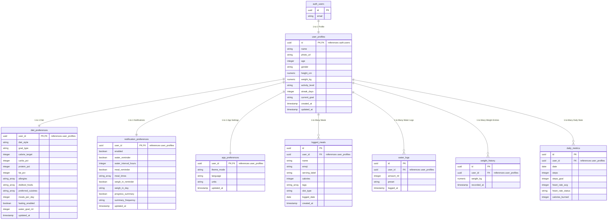

# Database Schema Design for Supabase (PostgreSQL)

This document provides the complete database design for the **Afia** mobile application. Since we are transitioning from Firebase to Supabase, we leverage a relational database model (PostgreSQL) which provides strong consistency, referential integrity, and Row-Level Security (RLS).

---

## Entity Relationship Diagram



---

## 1. Table Definitions (SQL DDL)

Here is the SQL schema to create the tables in your Supabase project.

```sql
-- Enable UUID extension if not enabled
create extension if not exists "uuid-ossp";

-- =========================================================================
-- 1. USER PROFILES
-- =========================================================================
create table public.user_profiles (
    id uuid references auth.users(id) on delete cascade primary key,
    name text not null,
    photo_url text,
    age integer,
    gender text check (gender in ('male', 'female', 'other')),
    height_cm numeric(5,2),
    weight_kg numeric(5,2),
    activity_level text check (activity_level in ('sedentary', 'lightly_active', 'moderately_active', 'very_active')),
    streak_days integer default 0 not null,
    current_goal text,
    created_at timestamp with time zone default timezone('utc'::text, now()) not null,
    updated_at timestamp with time zone default timezone('utc'::text, now()) not null
);

-- Comment to document table
comment on table public.user_profiles is 'Physical and biometric profiles for authenticated users.';

-- =========================================================================
-- 2. DIET PREFERENCES
-- =========================================================================
create table public.diet_preferences (
    user_id uuid references public.user_profiles(id) on delete cascade primary key,
    diet_style text default 'balanced' not null,
    goal_type text default 'maintain' not null,
    calorie_target integer,
    carbs_pct integer default 50 not null check (carbs_pct >= 0 and carbs_pct <= 100),
    protein_pct integer default 20 not null check (protein_pct >= 0 and protein_pct <= 100),
    fat_pct integer default 30 not null check (fat_pct >= 0 and fat_pct <= 100),
    allergies text[] default '{}'::text[] not null,
    disliked_foods text[] default '{}'::text[] not null,
    preferred_cuisines text[] default '{}'::text[] not null,
    meals_per_day integer default 3 not null,
    fasting_enabled boolean default false not null,
    water_goal_ml integer default 2500 not null,
    updated_at timestamp with time zone default timezone('utc'::text, now()) not null,
    constraint check_macro_sum check (carbs_pct + protein_pct + fat_pct = 100)
);

-- =========================================================================
-- 3. NOTIFICATION PREFERENCES
-- =========================================================================
create table public.notification_preferences (
    user_id uuid references public.user_profiles(id) on delete cascade primary key,
    enabled boolean default true not null,
    water_reminder boolean default true not null,
    water_interval_hours integer default 2 not null,
    meal_reminder boolean default true not null,
    meal_times text[] default '{"08:00", "13:00", "20:00"}'::text[] not null,
    weigh_in_reminder boolean default false not null,
    weigh_in_day text default 'Monday' not null,
    progress_summary boolean default false not null,
    summary_frequency text default 'weekly' not null,
    updated_at timestamp with time zone default timezone('utc'::text, now()) not null
);

-- =========================================================================
-- 4. APP PREFERENCES
-- =========================================================================
create table public.app_preferences (
    user_id uuid references public.user_profiles(id) on delete cascade primary key,
    theme_mode text default 'system' not null check (theme_mode in ('light', 'dark', 'system')),
    language text default 'ar' not null,
    units text default 'metric' not null check (units in ('metric', 'imperial')),
    updated_at timestamp with time zone default timezone('utc'::text, now()) not null
);

-- =========================================================================
-- 5. LOGGED MEALS
-- =========================================================================
create table public.logged_meals (
    id uuid default gen_random_uuid() primary key,
    user_id uuid references public.user_profiles(id) on delete cascade not null,
    name text not null,
    emoji text not null,
    serving_label text not null,
    calories integer not null,
    tags text[] default '{}'::text[] not null,
    slot_type text not null check (slot_type in ('breakfast', 'lunch', 'dinner', 'snack')),
    logged_date date default current_date not null,
    created_at timestamp with time zone default timezone('utc'::text, now()) not null
);

-- =========================================================================
-- 6. WATER LOGS
-- =========================================================================
create table public.water_logs (
    id uuid default gen_random_uuid() primary key,
    user_id uuid references public.user_profiles(id) on delete cascade not null,
    amount_ml integer not null,
    preset text default 'custom' not null check (preset in ('cup', 'pint', 'custom')),
    logged_at timestamp with time zone default timezone('utc'::text, now()) not null
);

-- =========================================================================
-- 7. WEIGHT HISTORY
-- =========================================================================
create table public.weight_history (
    id uuid default gen_random_uuid() primary key,
    user_id uuid references public.user_profiles(id) on delete cascade not null,
    weight_kg numeric(5,2) not null,
    recorded_at timestamp with time zone default timezone('utc'::text, now()) not null
);

-- =========================================================================
-- 8. DAILY HEALTH METRICS
-- =========================================================================
create table public.daily_metrics (
    id uuid default gen_random_uuid() primary key,
    user_id uuid references public.user_profiles(id) on delete cascade not null,
    date date default current_date not null,
    steps integer default 0 not null,
    steps_goal integer default 10000 not null,
    heart_rate_avg integer,
    heart_rate_status text,
    calories_burned integer default 0 not null,
    constraint unique_user_daily_metric unique (user_id, date)
);
```

---

## 2. Automation: Creating Profiles on Signup (Triggers)

To make onboarding seamless, we can write a PostgreSQL function and trigger inside Supabase. This function will automatically run whenever a user registers through Supabase Auth, creating a corresponding profile with defaults and basic preferences.

```sql
-- Create profile and preferences on Auth signup
create or replace function public.handle_new_user()
returns trigger as $$
begin
  -- Insert into public.user_profiles
  insert into public.user_profiles (id, name, streak_days)
  values (
    new.id,
    coalesce(new.raw_user_meta_data->>'name', 'User'),
    0
  );

  -- Insert default diet preferences
  insert into public.diet_preferences (user_id)
  values (new.id);

  -- Insert default notification preferences
  insert into public.notification_preferences (user_id)
  values (new.id);

  -- Insert default app preferences
  insert into public.app_preferences (user_id, language)
  values (new.id, coalesce(new.raw_user_meta_data->>'language', 'ar'));

  return new;
end;
$$ language plpgsql security definer;

-- Trigger the function on auth.users insert
create or replace trigger on_auth_user_created
  after insert on auth.users
  for each row execute procedure public.handle_new_user();
```

---

## 3. Row-Level Security (RLS) Policies

Supabase secures your database at the API layer using Postgres RLS. Users should only be allowed to read, write, and delete their own records.

```sql
-- Enable Row Level Security on all tables
alter table public.user_profiles enable row level security;
alter table public.diet_preferences enable row level security;
alter table public.notification_preferences enable row level security;
alter table public.app_preferences enable row level security;
alter table public.logged_meals enable row level security;
alter table public.water_logs enable row level security;
alter table public.weight_history enable row level security;
alter table public.daily_metrics enable row level security;

-- Define Policies

-- 1. user_profiles
create policy "Users can view their own profile."
  on public.user_profiles for select
  using (auth.uid() = id);

create policy "Users can update their own profile."
  on public.user_profiles for update
  using (auth.uid() = id);

-- 2. diet_preferences
create policy "Users can view their own diet preferences."
  on public.diet_preferences for select
  using (auth.uid() = user_id);

create policy "Users can update their own diet preferences."
  on public.diet_preferences for update
  using (auth.uid() = user_id);

-- 3. notification_preferences
create policy "Users can view their own notification preferences."
  on public.notification_preferences for select
  using (auth.uid() = user_id);

create policy "Users can update their own notification preferences."
  on public.notification_preferences for update
  using (auth.uid() = user_id);

-- 4. app_preferences
create policy "Users can view their own app preferences."
  on public.app_preferences for select
  using (auth.uid() = user_id);

create policy "Users can update their own app preferences."
  on public.app_preferences for update
  using (auth.uid() = user_id);

-- 5. logged_meals
create policy "Users can view their own logged meals."
  on public.logged_meals for select
  using (auth.uid() = user_id);

create policy "Users can insert their own logged meals."
  on public.logged_meals for insert
  with check (auth.uid() = user_id);

create policy "Users can delete their own logged meals."
  on public.logged_meals for delete
  using (auth.uid() = user_id);

-- 6. water_logs
create policy "Users can view their own water logs."
  on public.water_logs for select
  using (auth.uid() = user_id);

create policy "Users can insert their own water logs."
  on public.water_logs for insert
  with check (auth.uid() = user_id);

create policy "Users can delete their own water logs."
  on public.water_logs for delete
  using (auth.uid() = user_id);

-- 7. weight_history
create policy "Users can view their own weight history."
  on public.weight_history for select
  using (auth.uid() = user_id);

create policy "Users can insert their own weight history."
  on public.weight_history for insert
  with check (auth.uid() = user_id);

create policy "Users can delete their own weight history."
  on public.weight_history for delete
  using (auth.uid() = user_id);

-- 8. daily_metrics
create policy "Users can view their own daily metrics."
  on public.daily_metrics for select
  using (auth.uid() = user_id);

create policy "Users can insert or update their own daily metrics."
  on public.daily_metrics for all
  using (auth.uid() = user_id);
```

---

## 4. Query Optimization (Indexes)

To keep the application highly responsive as log data grows, we create indexes on query lookup columns (primarily combinations of `user_id` and dates).

```sql
-- Indexes for logged meals queries (by user and date range)
create index idx_logged_meals_user_date on public.logged_meals (user_id, logged_date);

-- Indexes for water logs (by user and timestamp range)
create index idx_water_logs_user_time on public.water_logs (user_id, logged_at desc);

-- Indexes for weight history (by user and time)
create index idx_weight_history_user_time on public.weight_history (user_id, recorded_at desc);

-- Indexes for daily metrics (by user and date)
create index idx_daily_metrics_user_date on public.daily_metrics (user_id, date desc);
```
