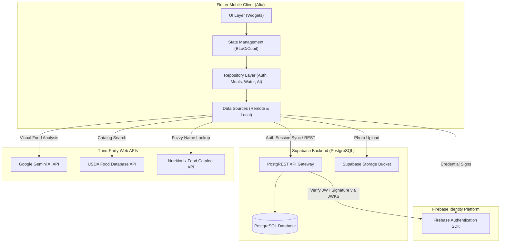

# System Overview

## Purpose
The purpose of this document is to outline the system architecture of Afia. It documents the relationship between the Flutter client, the dual-backend architecture (Firebase Authentication + Supabase PostgreSQL), and the third-party nutrition and AI API integrations.

## Overview
Afia is constructed as a distributed mobile system. The client side consists of a Flutter mobile application that acts as the primary user interface. The backend is split into two specialized components:
1. **Firebase Authentication:** Handles secure client logins, federated OAuth providers (Google, Apple), and token signatures.
2. **Supabase Backend:** Provides a hosted PostgreSQL relational database to manage user profiles, meal logs, hydration charts, and health metrics under Row-Level Security (RLS). It also serves as the image storage bucket.

The client leverages third-party APIs to extend its functionality:
- **Google Gemini API:** Performs visual food item identification ("Snap Your Plate") and nutritional estimation.
- **Nutritionix & USDA APIs:** Provides an extensive online food catalog for fuzzy search lookup.

## Design Decisions
To optimize security and development speed, the system implements a **Custom JWT Integration** between Firebase Auth and Supabase. On login, Firebase Auth returns a cryptographically signed **JSON Web Token (JWT)** containing the user's Firebase UID. The Flutter client intercepts this token and calls the Supabase SDK `setSession` API. 

Supabase decodes Google's public key (via its JWKS endpoint) to verify the token signature. The verified Firebase UID is then exposed directly inside the database session as `auth.uid()`, enabling secure Row-Level Security (RLS) checks on all relational queries without maintaining a custom server API.

## Internal Architecture
Below is the system integration layout mapping data flow and API boundaries:



## Workflow
### 1. Authentication & Session Syncing Workflow
- The user inputs credentials inside the UI.
- The `AuthRemoteDataSource` calls Firebase Auth to verify credentials.
- Firebase Auth returns an ID Token (JWT).
- The `AuthRepositoryImpl` captures the JWT and passes it to the `SupabaseClient` via `setSession()`.
- Supabase establishes a local session. Future calls include the token in HTTP headers.

### 2. Meal Tracking with AI Analysis Workflow
- The user snaps a photo of their plate.
- The image is processed locally and sent to `AiService`.
- Gemini analyzes the image, returning a structured JSON payload.
- The UI displays estimated calories and macros for user correction.
- Once confirmed, the meal is persisted to Supabase using a POST request.

## Important Classes
- [AuthRepositoryImpl](file:///mnt/6AF6AC44F6AC11FD/anaT3bt/NutriVision-AI-Driven-Dietary-Health-Assistant-T4/lib/features/auth/data/repositories/auth_repository_impl.dart): Intercepts authentication tokens to sync session contexts between Firebase and Supabase.
- [AiService](file:///mnt/6AF6AC44F6AC11FD/anaT3bt/NutriVision-AI-Driven-Dietary-Health-Assistant-T4/lib/core/services/ai_service.dart): Directly communicates with the Gemini model endpoints using structured prompts.
- [MealRemoteDataSource](file:///mnt/6AF6AC44F6AC11FD/anaT3bt/NutriVision-AI-Driven-Dietary-Health-Assistant-T4/lib/features/meals/data/datasources/meal_remote_datasource.dart): Executes PostgreSQL queries on the `logged_meals` table.

## Folder Structure
```
lib/
├── app/
│   ├── di/                 # Dependency injection setup (injection_container.dart)
│   ├── localization/       # Arabic translation files and cubit mapping
│   └── router/             # App routing and route registration
├── core/
│   ├── network/            # Network info and HTTP API clients
│   ├── services/           # Gemini AI API wrapper (ai_service.dart)
│   └── theme/              # Color definitions, typography, and spacing tokens
└── features/               # Architecture features (auth, meals, water, ai, explore, more)
```

## Advantages
- **Relational Integrity:** PostgreSQL handles constraints (e.g. linking `logged_meals` and `water_logs` to `user_profiles`), ensuring zero-orphan data.
- **Serverless Simplicity:** Integrating Firebase JWT signatures with Supabase RLS policies removes the need to write and deploy a custom Node.js/Go backend API.
- **Visual Nutrient Estimator:** Eliminates manual data entry by converting visual cues into database records.

## Trade-offs
- **Connection Overhead:** Syncing dual backends requires two network queries on startup (one to fetch Firebase token, one to verify with Supabase), increasing launch time.
- **SDK bloat:** Packing both Firebase and Supabase client libraries increases final app binary size.

## Limitations
- **Token Expiry Sync:** Firebase ID tokens expire after 60 minutes. If a Supabase call is made after this without token refresh, database queries will fail with a 401 error.
- **Wearable Device Synchronization:** Lacks a backend integration gateway to pull health metrics; it relies on client-side simulation.

## Future Improvements
- **Supabase Auth Migration:** Deprecate Firebase Auth and consolidate identity operations inside Supabase to eliminate dual SDK synchronization logic.
- **Local SQLite Caching:** Store all relational records locally to allow complete offline logging with synchronization once network access is restored.
