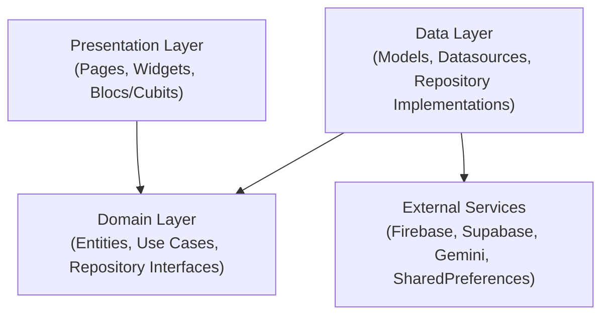
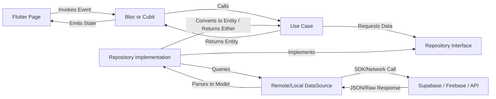

# Architecture of Afia

## Purpose
This document details the architectural design patterns, system boundaries, dependency direction rules, and dependency injection implementation within the **Afia** mobile application. It aims to clarify the system design for team members and external reviewers, ensuring consistency as the application grows.

## Overview
Afia is structured around a **Feature-First Clean Architecture** design. This blends the decoupling benefits of Uncle Bob's Clean Architecture with the modular organizational benefits of Feature-First packaging. For dependency resolution, the system uses the [get_it](https://pub.dev/packages/get_it) service locator pattern initialized at application startup.



## Design Decisions
1. **Clean Architecture Separation**: The app isolates business logic (Domain), data parsing and persistence logic (Data), and user interfaces (Presentation). This choice prevents SDK details (like Firebase Auth or Supabase clients) from scattering into UI widgets, making changes to vendors or caching strategies simple to perform.
2. **Feature-First Over Layer-First**: Organization is grouped around product capabilities (e.g., `auth`, `meals`, `water`, `ai`, `explore`, `more`) rather than technical types (`blocs`, `views`, `models`). This keeps files belonging to a single concept close together, avoiding "folder-hopping" during development and reducing version control conflicts in team projects.
3. **Manual GetIt Container**: Dependency wiring is consolidated in [injection_container.dart](file:///mnt/6AF6AC44F6AC11FD/anaT3bt/NutriVision-AI-Driven-Dietary-Health-Assistant-T4/lib/app/di/injection_container.dart). Explicit manual registration provides a centralized, easy-to-read "composition root" which makes checking the dependency graph during graduation discussions highly straightforward.
4. **Architectural Pragmatism (Transitional Features)**: While strict features (`auth`, `more`, `explore`) strictly use repositories and use cases, transitional features (`meals`, `water`) bypass repositories to map directly from Cubit to Remote DataSource. This compromise is explicitly accepted for speed, with a planned path for complete clean architecture migration.

## Internal Architecture
The application is separated into three distinct layers:
*   **Domain Layer**: The heart of the application containing enterprise and application business rules. It contains:
    *   **Entities**: Pure Dart model representations, independent of database structures (e.g., [WaterEntry](file:///mnt/6AF6AC44F6AC11FD/anaT3bt/NutriVision-AI-Driven-Dietary-Health-Assistant-T4/lib/features/water/domain/entities/water_entry.dart)).
    *   **Repository Interfaces**: Abstract classes defining the data operations required by the domain (e.g., [ExploreRepository](file:///mnt/6AF6AC44F6AC11FD/anaT3bt/NutriVision-AI-Driven-Dietary-Health-Assistant-T4/lib/features/explore/domain/repositories/explore_repository.dart)).
    *   **Use Cases**: Individual business operations (e.g., [CalculateDailyCalories](file:///mnt/6AF6AC44F6AC11FD/anaT3bt/NutriVision-AI-Driven-Dietary-Health-Assistant-T4/lib/features/auth/domain/usecases/calculate_daily_calories.dart) or [GetFoods](file:///mnt/6AF6AC44F6AC11FD/anaT3bt/NutriVision-AI-Driven-Dietary-Health-Assistant-T4/lib/features/explore/domain/usecases/get_foods.dart)).
*   **Data Layer**: Responsible for mapping data from external sources and implementing domain repository contracts. It contains:
    *   **Models**: Serialization and deserialization structures extending domain entities (e.g., [MealModel](file:///mnt/6AF6AC44F6AC11FD/anaT3bt/NutriVision-AI-Driven-Dietary-Health-Assistant-T4/lib/features/meals/data/models/meal_model.dart)).
    *   **Data Sources**: Raw client wrappers querying remote APIs or local cache (e.g., [AuthRemoteDataSourceImpl](file:///mnt/6AF6AC44F6AC11FD/anaT3bt/NutriVision-AI-Driven-Dietary-Health-Assistant-T4/lib/features/auth/data/datasources/auth_remote_datasource.dart)).
    *   **Repository Implementations**: Coordinates local/remote datasources, implements domain repositories, and maps errors into core failures (e.g., [MoreRepositoryImpl](file:///mnt/6AF6AC44F6AC11FD/anaT3bt/NutriVision-AI-Driven-Dietary-Health-Assistant-T4/lib/features/more/data/repositories/more_repository_impl.dart)).
*   **Presentation Layer**: Responsible for rendering UI and managing state. It uses:
    *   **Widgets/Pages**: Flutter rendering layout.
    *   **Blocs/Cubits**: State-management controllers executing use cases or calling services and exposing states (e.g., [ExploreBloc](file:///mnt/6AF6AC44F6AC11FD/anaT3bt/NutriVision-AI-Driven-Dietary-Health-Assistant-T4/lib/features/explore/presentation/bloc/explore_bloc.dart)).

### Dependency Graph

```mermaid
graph TD
    subgraph Presentation Layer
        AuthBloc
        ExploreBloc
        MealsCubit
        WaterRecordingCubit
        HomeCubit
        MoreCubit
        ProfileFormCubit
    end

    subgraph Domain Layer
        GetFoods
        LogFood
        GetMoreProfile
        UpdateUserProfile
        GetDietPreferences
        UpdateDietPreferences
        UploadProfileImage
        CalculateDailyCalories
        ExploreRepository["ExploreRepository (Interface)"]
        AuthRepository["AuthRepository (Interface)"]
        MoreRepository["MoreRepository (Interface)"]
    end

    subgraph Data Layer
        ExploreRepositoryImpl
        AuthRepositoryImpl
        MoreRepositoryImpl
        ExploreRemoteDataSource
        AuthRemoteDataSource
        MoreRemoteDataSource
        MoreLocalDataSource
        MealRemoteDataSource
        WaterRemoteDataSource
    end

    %% Presentation to Domain/Data dependencies
    AuthBloc --> AuthRepository
    ExploreBloc --> GetFoods
    ExploreBloc --> LogFood
    GetFoods --> ExploreRepository
    LogFood --> ExploreRepository
    MealsCubit --> MealRemoteDataSource
    MealsCubit --> MoreRemoteDataSource
    WaterRecordingCubit --> WaterRemoteDataSource
    HomeCubit --> MealRemoteDataSource
    HomeCubit --> WaterRemoteDataSource
    HomeCubit --> MoreRemoteDataSource
    HomeCubit --> MealsCubit
    HomeCubit --> WaterRecordingCubit
    MoreCubit --> GetMoreProfile
    MoreCubit --> UploadProfileImage
    ProfileFormCubit --> GetMoreProfile
    ProfileFormCubit --> UpdateUserProfile
    ProfileFormCubit --> GetDietPreferences
    ProfileFormCubit --> UpdateDietPreferences

    %% Domain Use cases to Repositories
    GetMoreProfile --> MoreRepository
    UpdateUserProfile --> MoreRepository
    GetDietPreferences --> MoreRepository
    UpdateDietPreferences --> MoreRepository
    UploadProfileImage --> MoreRepository

    %% Data implementations to interfaces
    ExploreRepositoryImpl -.-> ExploreRepository
    AuthRepositoryImpl -.-> AuthRepository
    MoreRepositoryImpl -.-> MoreRepository

    %% Repo implementations to DataSources
    ExploreRepositoryImpl --> ExploreRemoteDataSource
    AuthRepositoryImpl --> AuthRemoteDataSource
    MoreRepositoryImpl --> MoreRemoteDataSource
    MoreRepositoryImpl --> MoreLocalDataSource
```



## Workflow
Here is how calls and dependencies propagate through a typical clean architecture feature flow:



1.  **User Trigger**: The user presses a button on the UI (e.g., `LogFood` button in [ExplorePage](file:///mnt/6AF6AC44F6AC11FD/anaT3bt/NutriVision-AI-Driven-Dietary-Health-Assistant-T4/lib/features/explore/presentation/pages/explore_page.dart)).
2.  **Event Dispatch**: The Page dispatches an event or invokes a method on the `Bloc`/`Cubit` (e.g., `ExploreBloc`).
3.  **UseCase Execution**: The `Bloc` invokes the corresponding Use Case (e.g., [LogFood](file:///mnt/6AF6AC44F6AC11FD/anaT3bt/NutriVision-AI-Driven-Dietary-Health-Assistant-T4/lib/features/explore/domain/usecases/log_food.dart)).
4.  **Interface Request**: The Use Case requests data from the abstract `Repository` interface (e.g., `ExploreRepository`).
5.  **Implementation Call**: The framework calls the concrete implementation (`ExploreRepositoryImpl`) in the Data layer.
6.  **DataSource Query**: The implementation retrieves the data from a `DataSource` (e.g., [ExploreRemoteDataSourceImpl](file:///mnt/6AF6AC44F6AC11FD/anaT3bt/NutriVision-AI-Driven-Dietary-Health-Assistant-T4/lib/features/explore/data/datasources/explore_remote_datasource_impl.dart)).
7.  **Parsing & Mapping**: The data source decodes JSON into a Data Model, which the repository maps to a pure Domain Entity before passing it back up.
8.  **State Emission**: The `Bloc` receives the entity, wraps it in a State, and emits it to the UI for rendering.

## Important Classes
*   **[InjectionContainer](file:///mnt/6AF6AC44F6AC11FD/anaT3bt/NutriVision-AI-Driven-Dietary-Health-Assistant-T4/lib/app/di/injection_container.dart)**: The Composition Root of the application. It bootstraps database instances, shared preferences, API clients, use cases, repositories, and BLoC factories during startup.
*   **[CalculateDailyCalories](file:///mnt/6AF6AC44F6AC11FD/anaT3bt/NutriVision-AI-Driven-Dietary-Health-Assistant-T4/lib/features/auth/domain/usecases/calculate_daily_calories.dart)**: A pure business logic Use Case that computes BMR and daily caloric needs using the Mifflin-St Jeor equation. It has no external dependencies.
*   **[MoreRepositoryImpl](file:///mnt/6AF6AC44F6AC11FD/anaT3bt/NutriVision-AI-Driven-Dietary-Health-Assistant-T4/lib/features/more/data/repositories/more_repository_impl.dart)**: Coordinates local storage caching via SharedPreferences and remote storage syncing via Supabase, demonstrating repository-level coordination policies.
*   **[MealsCubit](file:///mnt/6AF6AC44F6AC11FD/anaT3bt/NutriVision-AI-Driven-Dietary-Health-Assistant-T4/lib/features/meals/presentation/cubit/meals_cubit.dart)**: Coordinates logging of user meals. Currently functions under a direct-datasource dependency structure as part of the transitional design phase.

## Folder Structure
Each Clean Architecture feature uses the following standardized tree layout:
```text
lib/features/explore/
├── data/
│   ├── datasources/                   # API / Storage endpoints
│   │   ├── explore_remote_datasource.dart
│   │   └── explore_remote_datasource_impl.dart
│   ├── models/                        # Serialized data representations
│   │   └── food_item_model.dart
│   └── repositories/                  # Concrete implementation of domain contracts
│       └── explore_repository_impl.dart
├── domain/
│   ├── entities/                      # Pure business models
│   │   └── food_item.dart
│   ├── repositories/                  # Contracts detailing requirements
│   │   └── explore_repository.dart
│   └── usecases/                      # Single-focused business operations
│       ├── get_foods.dart
│       └── log_food.dart
└── presentation/
    ├── bloc/                          # State controllers
    │   ├── explore_bloc.dart
    │   ├── explore_event.dart
    │   └── explore_state.dart
    ├── pages/                         # Core layouts
    │   └── explore_page.dart
    └── widgets/                       # Feature-specific subcomponents
        └── food_item_tile.dart
```

## Advantages
1.  **Testability**: Usecases (like `CalculateDailyCalories`) and repository boundaries can be unit-tested without rendering widgets or connecting to Firebase/Supabase.
2.  **Low Coupling**: UI developers can construct pages using abstract repositories or mocked Blocs before remote endpoints are completely built.
3.  **Vendor Independence**: If the team switches auth providers or AI models, the changes are isolated within specific Data Sources without leaking into the UI or business layers.
4.  **Graduation Project Defensibility**: Providing concrete separation of domain policies (pure Dart classes) from framework details is highly favored in academic reviews.

## Trade-offs
1.  **Indirection**: Finding the flow of execution requires navigating through interfaces and factory creators, adding step overhead during debugging.
2.  **Boilerplate**: The mapping between database models and domain entities requires manual conversion code (e.g., `toDomain()` or `fromEntity()`), adding code lines to maintain.
3.  **File Multiplicity**: Even tiny operations require creating a Use Case, repository contract, repository implementation, and data models.

## Limitations
1.  **Compile-Time DI Validation**: Using [get_it](https://pub.dev/packages/get_it) locator `sl()` relies on runtime type-matching. A missing dependency registration compiles successfully but causes a runtime crash upon page navigation.
2.  **Feature Consistency**: The Meals and Water features contain direct datasource dependencies in their Cubits, introducing a minor architectural inconsistency.
3.  **Cross-Feature Imports**: The dashboard ([HomeCubit](file:///mnt/6AF6AC44F6AC11FD/anaT3bt/NutriVision-AI-Driven-Dietary-Health-Assistant-T4/lib/features/main/presentation/cubit/home_cubit.dart)) directly depends on other cubits (`MealsCubit`, `WaterRecordingCubit`) and remote datasources, creating tight coupling between the shell and feature boundaries.

## Future Improvements
1.  **Code-Generated DI**: Transition the manual registration in [injection_container.dart](file:///mnt/6AF6AC44F6AC11FD/anaT3bt/NutriVision-AI-Driven-Dietary-Health-Assistant-T4/lib/app/di/injection_container.dart) to automated injection using `injectable` and `injectable_generator` to achieve compile-time graph validation.
2.  **Normalize Meals & Water Features**: Refactor `Meals` and `Water` to introduce use cases and repository contracts, establishing full architectural alignment across the codebase.
3.  **Feature Mediator Pattern**: Decouple [HomeCubit](file:///mnt/6AF6AC44F6AC11FD/anaT3bt/NutriVision-AI-Driven-Dietary-Health-Assistant-T4/lib/features/main/presentation/cubit/home_cubit.dart) from specific feature cubits by using a messaging pattern or domain-level events defined in `core/` to aggregate daily statistics.
