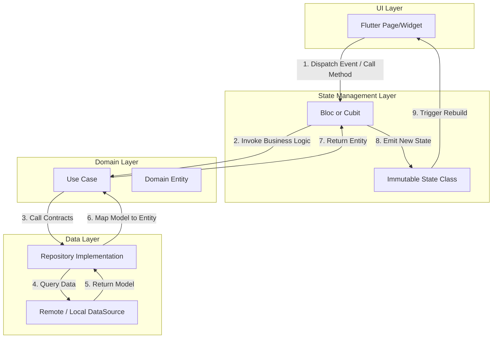
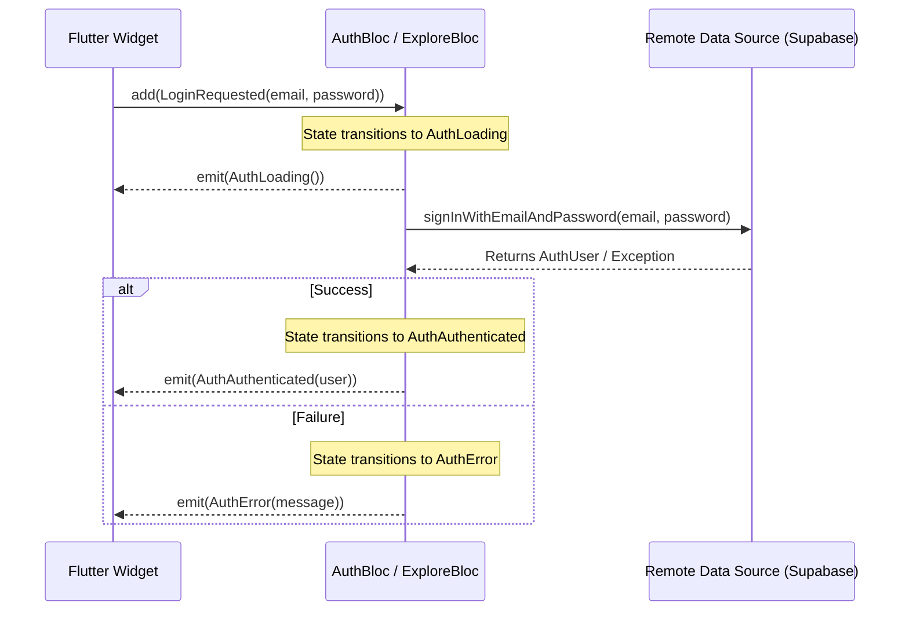
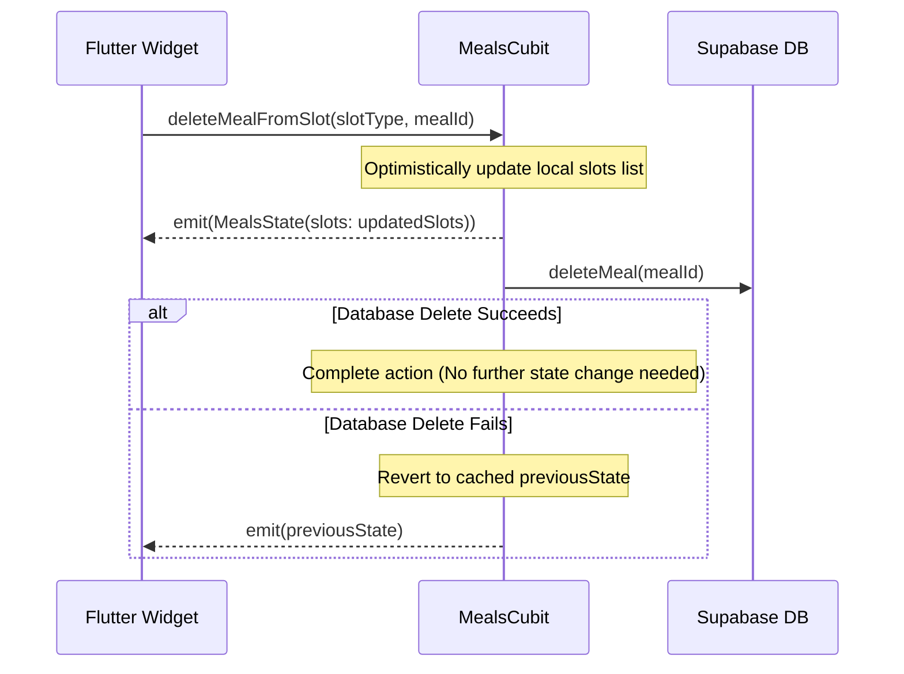

# State Management

## Purpose
This document details the state management architecture of the Afia application. It describes how state is isolated, transformed, and delivered to the user interface using the `flutter_bloc` package. This analysis covers the distinction between event-driven Blocs and method-driven Cubits, the reactive communication channels between them, and the patterns used to build a responsive, decoupled, and testable mobile app.

## Overview
State management in Afia acts as the presentation layer bridge between Flutter widgets and domain-layer use cases (or data-layer repositories). The app utilizes `flutter_bloc ^8.1.6` for all business logic containment. By separating state and state transitions from UI rendering:
1. Widgets are reduced to pure declarative representations of current state.
2. State mutations are driven by formal event objects (for Blocs) or explicit function calls (for Cubits).
3. The codebase remains highly testable, allowing layer verification via unit tests and mock repositories.

## Design Decisions

### 1. Bloc vs. Cubit Selection Matrix
Afia implements a dual-primitive strategy, utilizing both `Bloc` and `Cubit` depending on feature complexity and event pipeline requirements:

| State Primitive | Core Characteristic | Selection Criteria | Example in Afia |
| :--- | :--- | :--- | :--- |
| **Bloc** | Event-driven (Events $\rightarrow$ State transitions) | Used for asynchronous, multi-event, or complex pipelines that require custom event transformers (e.g., debouncing, throttling, or dropping/restarting events). | [AuthBloc](file:///mnt/6AF6AC44F6AC11FD/anaT3bt/NutriVision-AI-Driven-Dietary-Health-Assistant-T4/lib/features/auth/presentation/bloc/auth_bloc.dart), [ExploreBloc](file:///mnt/6AF6AC44F6AC11FD/anaT3bt/NutriVision-AI-Driven-Dietary-Health-Assistant-T4/lib/features/explore/presentation/bloc/explore_bloc.dart) |
| **Cubit** | Method-driven (Function calls $\rightarrow$ Direct emission) | Used for linear, simpler state transitions, local form controls, or direct CRUD operations triggered directly by UI actions. | [HomeCubit](file:///mnt/6AF6AC44F6AC11FD/anaT3bt/NutriVision-AI-Driven-Dietary-Health-Assistant-T4/lib/features/main/presentation/cubit/home_cubit.dart), [MealsCubit](file:///mnt/6AF6AC44F6AC11FD/anaT3bt/NutriVision-AI-Driven-Dietary-Health-Assistant-T4/lib/features/meals/presentation/cubit/meals_cubit.dart), [WaterRecordingCubit](file:///mnt/6AF6AC44F6AC11FD/anaT3bt/NutriVision-AI-Driven-Dietary-Health-Assistant-T4/lib/features/water/presentation/cubit/water_recording_cubit.dart) |

### 2. Debouncing and Concurrency Control
For search actions like food database queries in [ExploreBloc](file:///mnt/6AF6AC44F6AC11FD/anaT3bt/NutriVision-AI-Driven-Dietary-Health-Assistant-T4/lib/features/explore/presentation/bloc/explore_bloc.dart) and [MealSearchBloc](file:///mnt/6AF6AC44F6AC11FD/anaT3bt/NutriVision-AI-Driven-Dietary-Health-Assistant-T4/lib/features/meals/presentation/bloc/meal_search_bloc.dart), overlapping asynchronous requests pose a risk of out-of-order state updates and API waste. To address this, Afia utilizes a custom `_debounceRestartable` transformer combining `stream_transform`'s `debounce` and `bloc_concurrency`'s `restartable` logic:

```dart
const _debounceDuration = Duration(milliseconds: 300);

EventTransformer<E> _debounceRestartable<E>(Duration duration) {
  return (events, mapper) =>
      restartable<E>().call(events.debounce(duration), mapper);
}
```
This guarantees that rapid keystrokes are ignored until typing pauses for 300ms, and any ongoing search request is automatically cancelled if a new one is dispatched.

### 3. State Immutability via Equatable
All state classes extend `Equatable` to allow value-based comparisons. This ensures that the Flutter framework avoids unnecessary widget rebuilds when state properties have not changed.

## Internal Architecture



### Key Integration Patterns

#### 1. Reactive Cubit Composition (State Coordination)
Instead of forcing direct communication between pages, Afia registers a subscription pattern where the home page dashboard reactively adapts to logs submitted elsewhere. [HomeCubit](file:///mnt/6AF6AC44F6AC11FD/anaT3bt/NutriVision-AI-Driven-Dietary-Health-Assistant-T4/lib/features/main/presentation/cubit/home_cubit.dart) intercepts state streams of [MealsCubit](file:///mnt/6AF6AC44F6AC11FD/anaT3bt/NutriVision-AI-Driven-Dietary-Health-Assistant-T4/lib/features/meals/presentation/cubit/meals_cubit.dart) and [WaterRecordingCubit](file:///mnt/6AF6AC44F6AC11FD/anaT3bt/NutriVision-AI-Driven-Dietary-Health-Assistant-T4/lib/features/water/presentation/cubit/water_recording_cubit.dart):

```dart
_mealsSubscription = _mealsCubit.stream.listen((mealsState) {
  if (mealsState.status == MealsStatus.success || mealsState.status == MealsStatus.empty) {
    loadDashboardData();
  }
});
_waterSubscription = _waterRecordingCubit.stream.listen((waterState) {
  loadDashboardData();
});
```
This guarantees that whenever a user adds or deletes a meal, or registers a cup of water, the calorie intake rings and hydration percentages on the home tab are updated automatically.

#### 2. Optimistic UI Updates and Rollback
To create a snappy experience, [MealsCubit](file:///mnt/6AF6AC44F6AC11FD/anaT3bt/NutriVision-AI-Driven-Dietary-Health-Assistant-T4/lib/features/meals/presentation/cubit/meals_cubit.dart) uses optimistic updates when logging or deleting meals:
* **Add Meal**: It inserts a temporary meal with a local `temp_` ID into the state immediately. Once the remote datasource insert succeeds, the temporary ID is swapped with the real database UUID. If the insert fails, the Cubit rolls state back to `previousState`.
* **Delete Meal**: It filters out the selected meal from the local list immediately. If the remote database delete operation fails, the state is rolled back to include the meal.

## Workflow

### 1. BLoC Workflow (Event-Driven)
The Bloc workflow represents a strict unidirectional stream. UI widgets dispatch formal event classes that are queued, processed, and map to output states:



### 2. Cubit Workflow (Method-Driven)
The Cubit workflow operates similarly, but lacks an event queue. The UI directly invokes methods, which execute asynchronous logic and emit states:



## Important Classes

* **[AuthBloc](file:///mnt/6AF6AC44F6AC11FD/anaT3bt/NutriVision-AI-Driven-Dietary-Health-Assistant-T4/lib/features/auth/presentation/bloc/auth_bloc.dart)**: Tracks global authentication. Listens to reactive Firebase auth state changes and dispatches internal events to handle login, signup, verification, and email reload flows.
* **[ExploreBloc](file:///mnt/6AF6AC44F6AC11FD/anaT3bt/NutriVision-AI-Driven-Dietary-Health-Assistant-T4/lib/features/explore/presentation/bloc/explore_bloc.dart)**: Handles food catalog queries. Implements debounced/restartable event transformers for search, category filtering, and direct food logging.
* **[MealSearchBloc](file:///mnt/6AF6AC44F6AC11FD/anaT3bt/NutriVision-AI-Driven-Dietary-Health-Assistant-T4/lib/features/meals/presentation/bloc/meal_search_bloc.dart)**: Manages search queries and filters on local catalog items with debounced query change callbacks.
* **[AiBloc](file:///mnt/6AF6AC44F6AC11FD/anaT3bt/NutriVision-AI-Driven-Dietary-Health-Assistant-T4/lib/features/ai/presentation/bloc/ai_bloc.dart)**: Coordinates image picking (`ImagePicker`) and AI-powered meal plate analysis (using Google Gemini REST use cases).
* **[HomeCubit](file:///mnt/6AF6AC44F6AC11FD/anaT3bt/NutriVision-AI-Driven-Dietary-Health-Assistant-T4/lib/features/main/presentation/cubit/home_cubit.dart)**: Assembles overall dashboard data. Observes changes in meals and water cubits to calculate current progress values.
* **[MealsCubit](file:///mnt/6AF6AC44F6AC11FD/anaT3bt/NutriVision-AI-Driven-Dietary-Health-Assistant-T4/lib/features/meals/presentation/cubit/meals_cubit.dart)**: Manages daily calorie counts and macro distributions. Integrates optimistic inserts and deletes.
* **[WaterRecordingCubit](file:///mnt/6AF6AC44F6AC11FD/anaT3bt/NutriVision-AI-Driven-Dietary-Health-Assistant-T4/lib/features/water/presentation/cubit/water_recording_cubit.dart)**: Manages hydration logging, selected cup/pint presets, and historical entries.
* **[ProfileFormCubit](file:///mnt/6AF6AC44F6AC11FD/anaT3bt/NutriVision-AI-Driven-Dietary-Health-Assistant-T4/lib/features/more/presentation/cubit/profile_form_cubit.dart)**: Manages forms for updating personal information (name, height, weight, activity levels) and allergy configurations.

## Folder Structure
All state management classes are located within their respective feature folders in the presentation tier.

```
lib/features/
├── auth/
│   └── presentation/
│       └── bloc/
│           ├── auth_bloc.dart
│           ├── auth_event.dart
│           └── auth_state.dart
├── explore/
│   └── presentation/
│       └── bloc/
│           ├── explore_bloc.dart
│           ├── explore_event.dart
│           └── explore_state.dart
├── meals/
│   └── presentation/
│       ├── bloc/
│       │   ├── meal_search_bloc.dart
│       │   ├── meal_search_event.dart
│       │   └── meal_search_state.dart
│       └── cubit/
│           ├── meals_cubit.dart
│           └── meals_state.dart
├── water/
│   └── presentation/
│       └── cubit/
│           ├── water_recording_cubit.dart
│           └── water_recording_state.dart
└── main/
    └── presentation/
        └── cubit/
            ├── home_cubit.dart
            ├── home_state.dart
            ├── main_shell_cubit.dart
            └── main_shell_state.dart
```

## Advantages
1. **Separation of Concerns**: UI widgets contain zero database calls, JSON parsing logic, or API invocation code.
2. **Deterministic UI State**: The exact UI representation is a function of the immutable state emitted.
3. **Advanced Async Processing**: Built-in support for debouncing and query cancellation prevents race conditions.
4. **Snappy Optimistic Updates**: Delays from API writes are concealed, improving responsiveness.

## Trade-offs
1. **Boilerplate**: Standard Blocs require three separate files (bloc, event, state), increasing initial development overhead.
2. **Memory Footprint**: Keeping reactive listeners between different Cubits (like HomeCubit tracking MealsCubit) requires manual cancellation on close to prevent memory leaks.

## Limitations
1. **No Compile-time Event Queue Safety**: Developers must verify that all registered events have an active handler in the Bloc constructor.
2. **Manual Serialization**: There is no automatic state persistence/hydration wired up; closing the app kills in-memory Bloc state, making it fetch anew upon opening.

## Future Improvements
1. **Wired Hydration**: Integrate `hydrated_bloc` to automatically persist the states of preference cubits (like `LocaleCubit` or `AppPreferencesCubit`) to local storage.
2. **Injectable Generator DI Setup**: Migrate DI registrations in `InjectionContainer` from manual bindings to auto-generated `@injectable` bindings to reduce registry maintenance.
