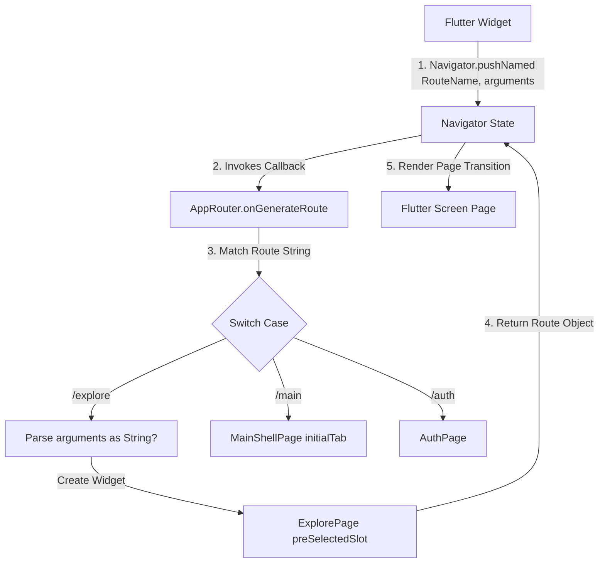

# Routing and Navigation

## Purpose
This document details the navigation architecture of the Afia application. It describes how route targets are defined, how transitions are managed using Flutter's manual named routing system, and how route parameters are parsed and passed between different parts of the application.

## Overview
Afia implements a centralized, declarative-style named routing architecture. Instead of pushing direct widget routes inside pages, navigation paths are registered in a single switch-case configuration. This isolates page setup logic (such as dependency injection retrieval and parameter parsing) from the interactive UI widgets.

The routing system contains two primary files:
1. **[RouteNames](file:///mnt/6AF6AC44F6AC11FD/anaT3bt/NutriVision-AI-Driven-Dietary-Health-Assistant-T4/lib/app/router/route_names.dart)**: Defines the route endpoints as abstract constants.
2. **[AppRouter](file:///mnt/6AF6AC44F6AC11FD/anaT3bt/NutriVision-AI-Driven-Dietary-Health-Assistant-T4/lib/app/router/app_router.dart)**: Intercepts named navigation requests and builds the corresponding widgets.

## Design Decisions

### 1. Manual Named Routing vs. Declarative Navigation Packages
Afia uses Flutter's native `onGenerateRoute` manual routing rather than packages like `go_router` or `AutoRoute`. This choice is based on:
* **Mobile-First Scope**: The application is primary target is mobile, meaning browser URL synchronization and deep link mapping are currently low priority.
* **Low Dependency Overhead**: Native routing avoids complex code-generation steps (`build_runner` rules) or package version synchronization risks.
* **Auditability**: All route widget constructors, route checks, and parameter conversions are visible in a single place.

### 2. Separation of Shell Tab Switching from Navigator Push
The application dashboard utilizes a central shell, [MainShellPage](file:///mnt/6AF6AC44F6AC11FD/anaT3bt/NutriVision-AI-Driven-Dietary-Health-Assistant-T4/lib/features/main/presentation/pages/main_shell_page.dart), containing four primary views: Home, Meals, Chat, and More.
* **Tab selection**: Switching views inside the bottom navigation uses a local [MainShellCubit](file:///mnt/6AF6AC44F6AC11FD/anaT3bt/NutriVision-AI-Driven-Dietary-Health-Assistant-T4/lib/features/main/presentation/cubit/main_shell_cubit.dart) to toggle the index of an `IndexedStack`. This prevents stacking multiple screens on the Navigator, conserving memory and ensuring standard back-button behavior.
* **Route redirects**: External screens can launch the shell page with a preselected active tab by routing to [RouteNames.meals](file:///mnt/6AF6AC44F6AC11FD/anaT3bt/NutriVision-AI-Driven-Dietary-Health-Assistant-T4/lib/app/router/route_names.dart#L12) or [RouteNames.more](file:///mnt/6AF6AC44F6AC11FD/anaT3bt/NutriVision-AI-Driven-Dietary-Health-Assistant-T4/lib/app/router/route_names.dart#L18). The router maps these requests to instantiate `MainShellPage` with an initial tab index argument.

## Internal Architecture



### Key Navigation Patterns

#### 1. Centralized Route Guard (Auth Gate Redirection)
The default initial route (`/`) maps to the [AuthPage](file:///mnt/6AF6AC44F6AC11FD/anaT3bt/NutriVision-AI-Driven-Dietary-Health-Assistant-T4/lib/features/auth/presentation/pages/auth_page.dart). The `AuthPage` is a state-based guard gate. Upon loading, it requests an authentication check:

* If state is `AuthUnauthenticated` or `AuthError`:
  It routes the user to onboarding (`/onboard`) using `pushReplacementNamed`.
* If state is `AuthAuthenticated`:
  * It verifies if the email is verified. If not, it redirects to `/auth/email-verification`.
  * It calls `MoreRepository` to check if user profile height and weight parameters are populated.
  * If height/weight are missing, it redirects to `/auth/physical-information` to complete registration.
  * If complete, it routes the user to the core dashboard (`/main`).

#### 2. Arguments Parsing and Context Passing
For features such as adding catalog items, screens must share contextual metadata. For example, logging food from the explore catalog requires knowing which meal slot (Breakfast, Lunch, Dinner, Snack) is active. 

* The caller pushes to `/explore` and passes the slot type as a string argument:
  ```dart
  Navigator.pushNamed(context, RouteNames.explore, arguments: 'breakfast');
  ```
* [AppRouter](file:///mnt/6AF6AC44F6AC11FD/anaT3bt/NutriVision-AI-Driven-Dietary-Health-Assistant-T4/lib/app/router/app_router.dart#L104-L109) intercepts the request, extracts the arguments, and injects them into the constructor:
  ```dart
  case RouteNames.explore:
    final preSelectedSlot = settings.arguments as String?;
    return MaterialPageRoute<void>(
      builder: (_) => ExplorePage(preSelectedSlot: preSelectedSlot),
      settings: settings,
    );
  ```
* If `preSelectedSlot` is present in [ExplorePage](file:///mnt/6AF6AC44F6AC11FD/anaT3bt/NutriVision-AI-Driven-Dietary-Health-Assistant-T4/lib/features/explore/presentation/pages/explore_page.dart#L839-L847), adding a food item automatically logs it to that slot and pops the page, skipping the slot selection popup.

#### 3. Post-Route Rebuild Callbacks
Since separate screens maintain distinct BLoC/Cubit instances, returning from a page (like `/water` or `/explore`) requires the home page dashboard metrics to reload. Afia achieves this by using asynchronous `Future` completions on route pops:
```dart
Navigator.pushNamed(context, RouteNames.water).then((_) {
  if (context.mounted) {
    context.read<HomeCubit>().loadDashboardData();
  }
});
```

## Workflow

### 1. App Startup & Auth Routing Workflow
This workflow displays the path taken from application launch to main dashboard presentation:

```mermaid
sequenceDiagram
    participant App as MaterialApp
    participant Gate as AuthPage
    participant Bloc as AuthBloc
    participant Repo as MoreRepository
    participant Router as AppRouter
    
    App->>Router: Load initialRoute ("/")
    Router->>Gate: Instantiate AuthPage
    Note over Gate: Add AuthCheckRequested event
    Gate->>Bloc: Verify Session State
    alt Unauthenticated
        Bloc-->>Gate: AuthUnauthenticated State
        Gate->>Router: pushReplacementNamed("/onboard")
    else Authenticated (No Profile Info)
        Bloc-->>Gate: AuthAuthenticated State
        Gate->>Repo: getProfile() (Null weight/height check)
        Repo-->>Gate: Needs physical registration details
        Gate->>Router: pushReplacementNamed("/auth/physical-information")
    </td>
    else Authenticated (Complete Profile)
        Bloc-->>Gate: AuthAuthenticated State
        Gate->>Repo: getProfile() (Profile returns weight/height)
        Repo-->>Gate: Completed Profile
        Gate->>Router: pushReplacementNamed("/main")
    end
```

### 2. Contextual Food Logging & Return Rebuild Workflow
This workflow shows the parameters-passing cycle during food searches and log completions:

```mermaid
sequenceDiagram
    participant Home as MealsPage (MainShell)
    participant Router as AppRouter
    participant Explore as ExplorePage
    participant Details as FoodDetailsSheet
    participant Bloc as ExploreBloc
    
    Home->>Router: pushNamed("/explore", arguments: "breakfast")
    Router->>Explore: Instantiate ExplorePage(preSelectedSlot: "breakfast")
    Explore->>Details: Click Food Item (Passes "breakfast")
    Details->>Bloc: Click "Add to Diary" (LogFoodItem under "breakfast")
    Note over Bloc: Logs food and dismisses dialog
    Bloc-->>Details: Success state
    Details->>Home: Pop page
    Note over Home: then() callback fires, calls loadMeals() to refresh UI
```

## Important Classes

* **[RouteNames](file:///mnt/6AF6AC44F6AC11FD/anaT3bt/NutriVision-AI-Driven-Dietary-Health-Assistant-T4/lib/app/router/route_names.dart)**: Central abstract class declaring all 31 route endpoints.
* **[AppRouter](file:///mnt/6AF6AC44F6AC11FD/anaT3bt/NutriVision-AI-Driven-Dietary-Health-Assistant-T4/lib/app/router/app_router.dart)**: Entry mapper intercepting path strings and returning Material routes.
* **[AuthPage](file:///mnt/6AF6AC44F6AC11FD/anaT3bt/NutriVision-AI-Driven-Dietary-Health-Assistant-T4/lib/features/auth/presentation/pages/auth_page.dart)**: Initial entry controller verifying token validity, email activation, and profile fields.
* **[MainShellPage](file:///mnt/6AF6AC44F6AC11FD/anaT3bt/NutriVision-AI-Driven-Dietary-Health-Assistant-T4/lib/features/main/presentation/pages/main_shell_page.dart)**: Wrapper component hosting the primary bottom navigation stack and overlaying the floating navigation bar.
* **[ExplorePage](file:///mnt/6AF6AC44F6AC11FD/anaT3bt/NutriVision-AI-Driven-Dietary-Health-Assistant-T4/lib/features/explore/presentation/pages/explore_page.dart)**: Catalog search interface that handles conditional direct insertion when passed active parameters.

## Folder Structure
All route and routing-related concerns are stored in the core application routing module:

```
lib/app/
└── router/
    ├── app_router.dart         # Switch-case mapping logic
    └── route_names.dart        # Route path constant values
```

## Advantages
1. **Unified Navigation Audit**: Adding, modifying, or removing application paths can be configured directly in two files.
2. **Explicit Type Casting**: Parameters are verified and cast to correct classes within the router, keeping widgets free of data verification logic.
3. **Optimized Bottom Navigation**: Tab selections use local states rather than router pops/pushes, maintaining clear stack states.

## Trade-offs
1. **Manual Configuration Overhead**: Developers must define string constants in `RouteNames` and also declare the view builder mapping in `AppRouter`.
2. **Lack of Compile-time Argument Safety**: Arguments are passed as untyped `Object?` via `settings.arguments`, which can lead to runtime errors if casting is wrong.

## Limitations
1. **No Out-of-the-box Deep Linking**: Constructing path conversions for incoming mobile deep links requires manual parsing before executing matching navigator pushes.
2. **Lack of Declarative Guard Middleware**: Guard validations (like checking auth states) must occur inside widget hooks (like `initState` or `BlocListener` inside `AuthPage`) rather than being handled at the router middleware level.

## Future Improvements
1. **Type-Safe Route Definition**: Migrate to a code-generated typed routing approach (using tools like `go_router_builder` or `AutoRoute` generators) to ensure compile-time verification of route arguments.
2. **Centralized Middleware Guards**: Introduce router redirection middleware to verify authenticated states before initializing route widgets, eliminating the need for loading widgets like `AuthPage`.
