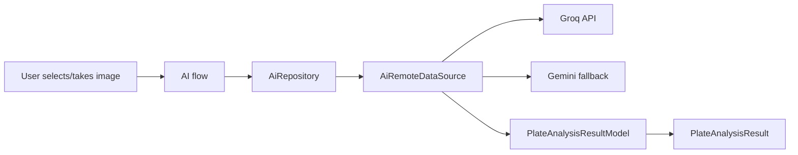

# AI APIs

## Overview

AI APIs allow Afia to analyze food images and produce structured nutrition estimates. The current AI datasource uses a provider fallback strategy: Groq vision-capable models are attempted first when configured, then Gemini is used as a fallback.

## Problem Statement

Food recognition is difficult to implement manually. A rule-based system cannot reliably identify dishes from images, especially Arabic and Middle Eastern foods with varied presentation. The app needs probabilistic recognition but must turn the model output into structured data the UI can confirm and save.

## Why We Chose It

AI APIs fit this project because food recognition and natural-language meal assistance are core demo features. The team can demonstrate image analysis without training a custom model. The datasource asks the model for strict JSON so the result can map to `PlateAnalysisResultModel`.

## How It Is Used In Our Project

The implementation includes retry behavior for Gemini rate limits and structured parsing of model responses.

## Advantages

- **Rapid capability**: Advanced image recognition without training infrastructure.
- **Provider fallback**: Reduces dependence on one AI API.
- **Structured output**: JSON schema enables mapping to domain objects.
- **Domain-specific prompting**: Prompts emphasize Arabic and Middle Eastern dishes.

## Tradeoffs

- **Uncertain accuracy**: AI estimates can be wrong and require user confirmation.
- **Latency**: Image upload and model inference take time.
- **Cost and rate limits**: API usage must be controlled.
- **Parsing fragility**: Models may return invalid or incomplete JSON.
- **Privacy concerns**: Food images are sent to external services.

## Alternatives Considered

| Alternative | Strength | Limitation |
|---|---|---|
| Custom ML model | Full control | Requires dataset, training, and evaluation |
| Manual food search only | Predictable | Less impressive and slower for users |
| Barcode database | Accurate for packaged food | Does not solve cooked plate recognition |

## Why This Choice Fits Our Project Better

Afia's graduation scope needs a working AI feature rather than a full computer vision research pipeline. External AI APIs are appropriate if the app treats results as estimates and includes confirmation before saving.

## Scalability Analysis

AI integration can scale by adding provider abstraction, caching repeated results, limiting image size, and separating chat, recipe parsing, and vision into focused use cases. The team should monitor latency, rate limits, and failure rates before relying on AI for critical calculations.

## Interview / Discussion Questions

1. **Why require JSON output?**  
   The app needs machine-readable fields for calories, macros, and labels.

2. **Can AI output be trusted directly?**  
   No. It should be treated as an estimate and confirmed by the user.

3. **Why use fallback providers?**  
   To reduce failure when one provider is unavailable or rate-limited.

4. **Where should API keys live?**  
   Outside source control and preferably behind a backend for production.

5. **What is the privacy risk?**  
   User images are sent to external services.

6. **Why not train a model?**  
   Training requires data, infrastructure, and evaluation beyond the project scope.

7. **What happens if the model returns invalid JSON?**  
   The datasource should fail gracefully and show a recoverable error.

8. **How can accuracy be improved?**  
   Better prompts, confirmation UI, nutrition database mapping, and feedback loops.

9. **Why should AI not write directly to meals?**  
   Users need a chance to correct estimates before saving health data.

10. **What metrics would you track?**  
   success rate, latency, correction frequency, and provider error rate.

## Common Mistakes

- Presenting AI estimates as exact facts.
- Mixing prompt text directly into UI widgets.
- Saving AI meals without confirmation.
- Ignoring rate limits and retry behavior.

## Best Practices

- Keep AI calls in datasources/services.
- Validate and sanitize model output.
- Show confirmation before saving.
- Avoid logging images or sensitive prompts.
- Design fallbacks for provider errors.

## Summary

AI APIs are appropriate for Afia's food recognition goals because they provide practical image understanding within the project scope. Their limitations require confirmation UI, careful error handling, and honest presentation as estimates.
