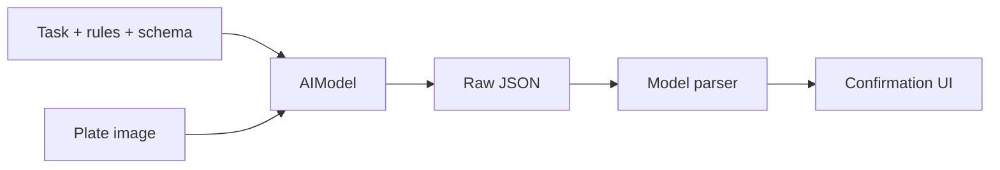

# Prompt Engineering

## Overview

Prompt engineering is the practice of giving an AI model precise task instructions, output constraints, and domain context. In Afia, prompts are used to guide food recognition toward structured nutrition data.

## Problem Statement

General AI models may identify a dish vaguely, omit fields, invent details, or return conversational text. Afia needs specific dish identification, Arabic-friendly labels, nutrition estimates, and parseable JSON.

## Why We Chose It

Prompt constraints are necessary because the app consumes model output programmatically. The current AI datasource includes strict schema instructions and asks for specific Arabic/Middle Eastern dish names where relevant.

## How It Is Used In Our Project

The prompt requests fields such as English name, Arabic name, serving label, calories, macros, calcium, vitamins, and tags.

## Advantages

- **More consistent parsing**: Schema instructions reduce free-form responses.
- **Domain focus**: Food-specific rules improve relevance.
- **Localization support**: Arabic labels can be requested from the model.
- **Faster iteration**: Prompts can improve behavior without retraining a model.

## Tradeoffs

- **No guarantee**: Models can still violate instructions.
- **Prompt length cost**: Longer prompts consume more tokens and may increase latency.
- **Maintenance**: Prompts must evolve with model behavior.
- **Overconfidence risk**: Detailed output may look more precise than it is.

## Alternatives Considered

| Alternative | Strength | Limitation |
|---|---|---|
| Fine-tuning | More specialized behavior | Requires data and provider support |
| Post-processing only | Deterministic validation | Cannot fix poor recognition alone |
| Nutrition database search | More factual nutrition | Needs accurate dish/entity matching first |

## Why This Choice Fits Our Project Better

For a graduation app, prompt engineering is a practical way to obtain structured AI behavior quickly. It should be combined with validation and confirmation rather than treated as a complete correctness guarantee.

## Scalability Analysis

Prompts should be versioned and kept out of large UI files. As features grow, separate prompts should exist for plate analysis, recipe conversion, snack discovery, and chat. The team can track model failures and refine prompts based on observed errors.

## Interview / Discussion Questions

1. **Why specify a JSON schema in the prompt?**  
   Because the app needs predictable fields for parsing.

2. **Does a prompt guarantee correctness?**  
   No. It improves behavior but cannot enforce truth.

3. **Why include Arabic dish examples?**  
   The target users are Arabic-speaking and regional dishes matter.

4. **What is hallucination?**  
   A plausible but unsupported model output.

5. **How can hallucination be reduced?**  
   Clear constraints, validation, database cross-checking, and user confirmation.

6. **Why not ask for a paragraph?**  
   Paragraphs are harder to parse and save.

7. **What should happen when required fields are missing?**  
   Reject the result or ask the user to retry/edit.

8. **Why keep prompts outside widgets?**  
   Prompts are service logic, not UI rendering logic.

9. **How do prompts affect cost?**  
   Longer prompts increase token usage.

10. **How would you evaluate prompt quality?**  
   Test against sample food images and measure identification/correction rates.

## Common Mistakes

- Assuming strict wording forces exact compliance.
- Making prompts too vague.
- Mixing UI copy and provider prompt logic.
- Ignoring localization and regional food names.

## Best Practices

- Ask for structured output.
- Validate every response.
- Keep prompts versioned and reviewed.
- Include domain examples relevant to users.
- Use confirmation for health-related estimates.

## Summary

Prompt engineering fits Afia because it turns general AI APIs into a more structured food-analysis component. It is useful but insufficient alone, so validation and user correction remain necessary.
