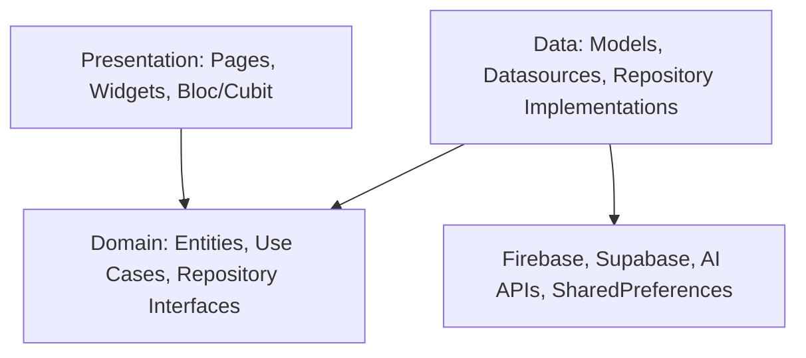
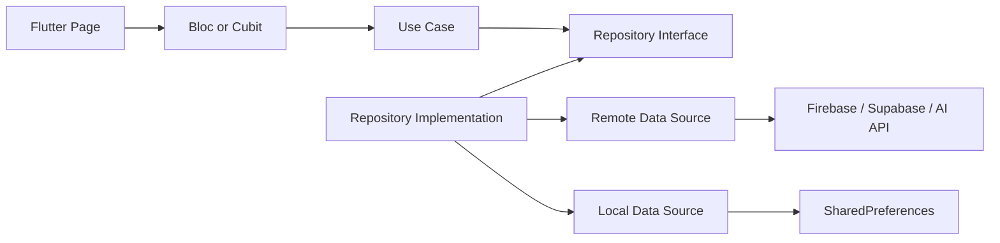

# Clean Architecture

## Overview

Clean Architecture separates application code by responsibility. In Afia, UI code belongs to the presentation layer, business rules belong to the domain layer, and external systems belong to the data layer. The goal is not to add ceremony for its own sake; the goal is to keep nutrition logic, authentication flow, AI analysis, and persistence concerns from being mixed inside Flutter widgets.

## Problem Statement

Afia has many features that depend on asynchronous services: Firebase Authentication, Supabase tables, profile storage, AI image analysis, local cache, and nutrition APIs. Without separation, widgets would directly call SDKs, parse response maps, handle errors, and update UI state at the same time. That makes code hard to test and risky to change, especially when a provider changes or when mock data is replaced by real integrations.

## Why We Chose It

Clean Architecture fits this project because the application is larger than a simple CRUD demo. Auth, meals, water, AI, explore, profile, and dashboard screens each have their own behavior and data needs. The team can work on separate layers without blocking each other: one developer can build UI against a repository interface while another implements Supabase or AI datasources.

It also supports the graduation project discussion. Instructors can inspect whether business rules are testable independently from Flutter and whether external dependencies are isolated. The `CalculateDailyCalories` use case is a clear example: it can be tested without rendering screens or connecting to a backend.

## How It Is Used In Our Project

Typical flow:

Examples in the repository:

- Auth uses `AuthBloc`, `AuthRepository`, `AuthRepositoryImpl`, and `AuthRemoteDataSource`.
- More/Profile uses use cases such as `GetMoreProfile`, `UpdateUserProfile`, and `UploadProfileImage`.
- AI plate analysis has domain entities, repository interfaces, a repository implementation, and remote datasource integration.
- Some screens are still transitional: parts of AI chat UI still contain direct service logic and should continue moving toward the same layering model.

## Advantages

- **Testable business rules**: Use cases and repositories can be tested without Flutter widgets.
- **Replaceable integrations**: Firebase, Supabase, Groq, Gemini, or local cache can change with limited impact on presentation code.
- **Clear ownership**: Developers know where to place UI logic, business operations, mapping code, and SDK calls.
- **Lower regression risk**: A change to profile caching should not require editing dashboard widgets.
- **Supports mock-to-real migration**: Features can start with mock cubit data and later move to repositories.

## Tradeoffs

- **More files**: Small features require entities, repositories, datasources, states, and use cases.
- **More boilerplate**: Mapping between models and entities adds code.
- **Learning curve**: Developers must understand dependency direction and avoid importing data classes into domain code.
- **Overhead for simple screens**: Static pages like About or FAQs may not need a complete domain/data stack.
- **Consistency cost**: Partial implementations become visible; if one feature bypasses the layers, the architecture becomes harder to reason about.

## Alternatives Considered

| Alternative | When It Works | Limitation For Afia |
|---|---|---|
| Widget-centered architecture | Very small apps or prototypes | SDK calls and parsing tend to leak into UI |
| MVC | Simple CRUD screens | Flutter widgets often become large controllers |
| MVVM | Apps focused on view models and binding | Still needs repository boundaries for multiple backends |
| Layer-first folders | Teams organized by technical layer | Harder to work feature-by-feature in a student team |

## Why This Choice Fits Our Project Better

Afia has independent features that will evolve at different speeds. Clean Architecture allows Auth to be production-ready while Meals or AI continue being refactored. The architecture also supports external service diversity: Firebase Auth, Supabase profile data, AI providers, and local cache have different failure modes, but they can all be represented through repository contracts.

## Scalability Analysis

Adding a feature means creating a feature folder with presentation, domain, and data boundaries. New developers can inspect one feature without scanning the whole app. Testing scales because use cases can be unit tested and blocs can be tested with mocked repositories. Maintenance improves because provider-specific code remains in data sources instead of spreading through widgets.

## Interview / Discussion Questions

1. **Why does the domain layer not depend on Firebase or Supabase?**  
   Because domain code should represent app rules, not provider APIs. This keeps use cases testable and prevents backend changes from forcing business logic rewrites.

2. **Is Clean Architecture required for every screen?**  
   No. Static screens may remain simple. It is most valuable where state, business rules, and external data interact.

3. **What is the difference between an entity and a model?**  
   An entity represents business data used by the app. A model knows how to serialize or deserialize provider-specific formats.

4. **Why not call Supabase directly from a Cubit?**  
   That couples UI state to backend details and makes offline fallback, mocking, and provider replacement harder.

5. **Where should calorie calculation logic live?**  
   In a domain use case, because it is business logic and should be testable without the UI.

6. **What happens when an AI provider changes response format?**  
   The remote datasource and model mapping should absorb that change. UI and domain entities should remain stable where possible.

7. **Can Clean Architecture slow development?**  
   Initially yes, because it adds structure. It pays off when features grow or integrations change.

8. **What is a sign that the architecture is being violated?**  
   Widgets importing Firebase SDK classes, JSON maps, or data models directly for business behavior.

9. **Why are repository interfaces in the domain layer?**  
   Use cases depend on capabilities, not implementations. The data layer implements those capabilities.

10. **How would you refactor an existing mock Cubit feature?**  
   Extract entity and repository interface, move mock or real fetching into a datasource/repository, then inject the use case into the Cubit.

## Common Mistakes

- Treating Clean Architecture as folder naming only. The important rule is dependency direction.
- Putting JSON parsing in widgets because it is quick during prototyping.
- Creating use cases that simply forward calls without adding clarity.
- Letting data models replace entities throughout the app.

## Best Practices

- Keep domain files free from Flutter, Firebase, Supabase, Dio, and SharedPreferences imports.
- Use `Either<Failure, T>` or another explicit result type for recoverable failures.
- Keep use cases small and named after user actions.
- Let repository implementations coordinate remote and local data sources.
- Add architecture only where it reduces coupling or improves testability.

## Summary

Clean Architecture is appropriate for Afia because the app combines many features, multiple external services, asynchronous flows, and testable health-related logic. It introduces boilerplate, but the separation helps the team maintain and defend the system as it grows.
