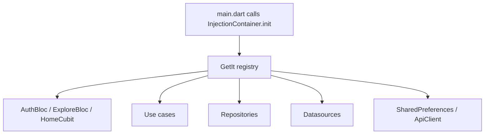

# Dependency Injection

## Overview

Dependency Injection means objects receive their dependencies from the outside instead of constructing them internally. Afia uses `get_it` as a service locator through `InjectionContainer.init()`.

## Problem Statement

Blocs, repositories, use cases, and datasources depend on each other. If each class creates its own dependencies, testing becomes difficult and lifecycle management becomes inconsistent. For example, a `HomeCubit` needs meal, water, and profile dependencies; constructing all of that inside the widget would make the UI responsible for infrastructure.

## Why We Chose It

`get_it` is lightweight and appropriate for a Flutter graduation project because it gives explicit registration without requiring a large framework. The project also includes `injectable`, but the current implementation is mostly manual registration. That is reasonable while the dependency graph is still changing, with a future path to generated registrations.

## How It Is Used In Our Project

The current container registers shared dependencies such as `SharedPreferences` and `ApiClient`, then registers use cases, blocs/cubits, repositories, datasources, and services.

## Advantages

- **Testability**: Constructors can receive mocks.
- **Centralized wiring**: Dependency graph is visible in one place.
- **Lifecycle control**: Factories and lazy singletons are chosen explicitly.
- **Cleaner widgets**: UI code requests ready blocs/cubits instead of building deep graphs.

## Tradeoffs

- **Runtime errors**: Missing registrations fail at runtime, not compile time.
- **Global access risk**: Service locator can be overused as hidden global state.
- **Manual maintenance**: Adding dependencies requires updating the container.
- **Order sensitivity**: Some dependencies must be available before others.

## Alternatives Considered

| Alternative | Strength | Weakness For Afia |
|---|---|---|
| Manual constructor wiring in widgets | Simple for tiny apps | Becomes noisy with many features |
| Provider-only dependency tree | Flutter-native | Can become deeply nested |
| Injectable generated DI | Less manual code | Requires build_runner discipline |
| Riverpod providers | Strong dependency model | Would introduce another state/dependency approach |

## Why This Choice Fits Our Project Better

The team already uses BLoC/Cubit and feature-first folders. `get_it` keeps dependency creation separate without changing the state management approach. It is also easy to explain during review: the container is the composition root.

## Scalability Analysis

As the app grows, the container should either be split into feature registration methods or migrated to `injectable` generation. Tests can override dependencies or instantiate classes directly. Maintenance remains manageable if registration is reviewed whenever a new repository or datasource is added.

## Interview / Discussion Questions

1. **What is the composition root?**  
   The place where object graphs are assembled; in Afia, `InjectionContainer.init()`.

2. **Why not instantiate repositories inside blocs?**  
   That would hide dependencies and make blocs harder to test.

3. **Factory or singleton for blocs?**  
   Usually factory, because UI state should not be accidentally shared across screens unless intended.

4. **Why use lazy singleton for repositories?**  
   Repository instances are generally stateless coordinators and can be reused.

5. **What can go wrong with service locators?**  
   They can become global mutable access points if used directly everywhere.

6. **How do we test a class with DI?**  
   Pass mock dependencies to its constructor or register test doubles.

7. **Why is missing DI registration risky?**  
   The app may compile but fail when a screen requests the dependency.

8. **Why include `injectable` if registration is manual?**  
   It provides a path to generated wiring once the graph stabilizes.

9. **Where should SDK instances be registered?**  
   Near the composition root or inside datasource constructors when the SDK provides safe singletons.

10. **How should the container evolve?**  
   Split by feature or use generated DI to reduce manual errors.

## Common Mistakes

- Calling `sl()` deep inside domain logic instead of constructor injection.
- Registering UI state as a singleton when it should be screen-scoped.
- Forgetting to update DI after adding a new constructor parameter.
- Treating DI as a replacement for clear architecture.

## Best Practices

- Prefer constructor injection.
- Keep `sl` access near presentation wiring or composition code.
- Use factories for blocs/cubits with mutable UI state.
- Add tests that instantiate blocs with mock repositories.
- Consider generated DI when registrations become repetitive.

## Summary

Dependency Injection fits Afia because the app has many collaborating objects and external services. Manual `get_it` registration is pragmatic at this stage, with a clear migration path to generated registration as the project matures.
