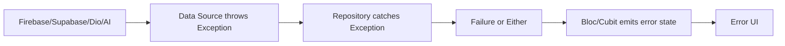

# Error Handling

## Overview

Error handling defines how failures move through the application. Afia uses domain-level `Failure` classes and data-level `Exception` classes, with repositories converting provider errors into app-level results.

## Problem Statement

External services fail in different ways: network timeouts, Firebase auth errors, Supabase failures, AI rate limits, invalid images, and cache misses. If these errors leak directly to UI code, every screen must understand every provider.

## Why We Chose It

Afia needs predictable user-facing states. A failed profile fetch can fall back to cache; a failed AI request should show a clear message; auth errors should not crash the app. Separating exceptions from failures keeps provider-specific details out of domain and presentation code.

## How It Is Used In Our Project

`ApiClient` maps Dio network problems to `ServerException`. Repository implementations, such as `MoreRepositoryImpl`, catch `ServerException` and may return cached data or `Failure` values.

## Advantages

- **Consistent UI states**: Screens can react to failures uniformly.
- **Provider isolation**: Firebase or Dio exceptions do not spread everywhere.
- **Offline fallback**: Cache recovery can happen centrally.
- **Improved tests**: Failure scenarios can be simulated without real network calls.

## Tradeoffs

- **Mapping effort**: Each datasource must translate provider errors.
- **Information loss risk**: Overly generic failures hide useful diagnostics.
- **Inconsistent adoption**: Features still in transition may handle errors differently.
- **More code paths**: Success, server failure, cache failure, and validation failure must be tested.

## Alternatives Considered

| Alternative | Strength | Limitation |
|---|---|---|
| Throw exceptions everywhere | Simple initially | Hard to present consistent UI |
| Return nullable values | Less code | Loses failure reason |
| Global error handler only | Useful for crashes | Not enough for recoverable errors |

## Why This Choice Fits Our Project Better

Afia handles health-related user data and external AI output. The app should distinguish between invalid input, temporary service failure, missing cache, and authentication failure. Explicit failure types make these cases easier to reason about.

## Scalability Analysis

As more integrations are added, consistent error handling becomes more important. New datasources should throw known exceptions, repositories should map them, and blocs should expose stable states. This avoids duplicating error logic across screens.

## Interview / Discussion Questions

1. **Why separate exceptions and failures?**  
   Exceptions are implementation-level; failures are application-level outcomes.

2. **Where should Dio errors be handled?**  
   In network/data layers, not directly in widgets.

3. **Why not catch every error in the UI?**  
   UI should decide presentation, not provider-specific recovery policy.

4. **What is a cache failure?**  
   A failure to read expected local data after remote data is unavailable.

5. **When should an exception be rethrown?**  
   When a lower layer cannot handle or translate it meaningfully.

6. **How should AI rate limits be represented?**  
   As a recoverable server or rate-limit failure with a user-safe message.

7. **What is the danger of `catch (e)` everywhere?**  
   It hides error categories and makes debugging harder.

8. **How do failures help testing?**  
   Tests can assert specific failure states without real SDK failures.

9. **Should logs contain user data?**  
   No. Logs should avoid sensitive health and auth data.

10. **How does error handling affect offline support?**  
   It defines when to fall back to cache and when to show an error.

## Common Mistakes

- Displaying raw exception strings to users.
- Swallowing errors without logging or state changes.
- Treating all failures as server failures.
- Mixing validation errors with infrastructure failures.

## Best Practices

- Use specific failure classes where behavior differs.
- Keep user messages clear and non-technical.
- Log technical details without sensitive data.
- Test failure paths, not only success paths.

## Summary

Afia's error strategy is appropriate because the app depends on several unreliable external services. Explicit failures and repository-level mapping keep error behavior predictable and defendable.
