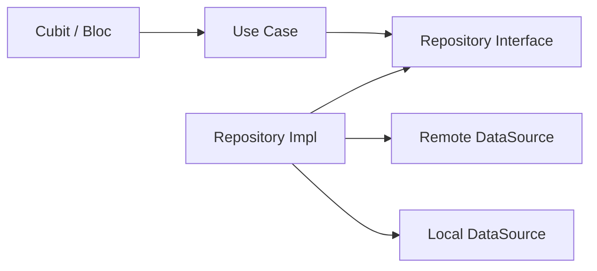

# Repository Pattern

## Overview

The Repository Pattern provides a stable interface between application logic and data sources. In Afia, repositories hide whether data comes from Firebase, Supabase, AI APIs, local cache, or mock sources.

## Problem Statement

Afia reads and writes data from several places. Profile data may come from Supabase or cache. Authentication comes from Firebase. AI food recognition comes from remote model APIs. If UI code depends directly on those providers, every provider change becomes a UI change.

## Why We Chose It

The repository boundary is appropriate because the project has multiple asynchronous data providers and some features need fallback behavior. For example, `MoreRepositoryImpl` loads remote profile data, caches it locally, and falls back to cache on server failure. That coordination does not belong in a widget.

## How It Is Used In Our Project

Examples:

- `AuthRepository` abstracts Firebase auth operations.
- `MoreRepository` coordinates Supabase and SharedPreferences cache.
- `ExploreRepository` abstracts food retrieval and logging.
- `AiRepository` abstracts plate analysis from AI provider details.

## Advantages

- **Provider isolation**: Firebase and Supabase details remain in data code.
- **Centralized fallback behavior**: Repositories decide when to use cache.
- **Mockable contracts**: Tests can mock repository interfaces.
- **Consistent error mapping**: Exceptions can become `Failure` values.
- **Simpler UI state**: Blocs receive domain results, not provider response maps.

## Tradeoffs

- **Extra indirection**: Debugging requires tracing through interfaces.
- **Mapping code**: Models and entities must be converted carefully.
- **Potential thin wrappers**: Some repositories may initially only forward calls.
- **Consistency burden**: Every feature should handle errors in a similar way.

## Alternatives Considered

| Alternative | Appropriate When | Why Not Primary Here |
|---|---|---|
| Direct SDK calls in Bloc | Small prototype | Couples state management to backend |
| Service classes only | Simple integrations | Often lacks domain-level contracts |
| Active Record style models | CRUD-heavy server apps | Not idiomatic for Flutter Clean Architecture |

## Why This Choice Fits Our Project Better

Afia expects backend evolution. Meals, water, AI, and explore can change providers or add local cache. Repositories give the project a controlled place to make those changes without rewriting presentation code.

## Scalability Analysis

When adding a new datasource, such as a nutrition API fallback, the repository can choose between providers. New developers can test use cases with mock repositories. Maintenance improves because data policy is visible in one implementation rather than repeated across screens.

## Interview / Discussion Questions

1. **What problem does a repository solve?**  
   It separates application behavior from data retrieval and persistence details.

2. **Why not return Firebase `User` from domain code?**  
   That would couple the domain layer to Firebase and make provider replacement harder.

3. **Where should offline fallback be implemented?**  
   Usually in the repository, because it coordinates remote and local sources.

4. **Should every repository have both local and remote datasources?**  
   No. Only features that need caching or offline behavior require both.

5. **What is a bad repository implementation?**  
   One that leaks JSON, SDK classes, or transport exceptions to the presentation layer.

6. **How does repository help testing?**  
   Blocs and use cases can depend on a mocked repository interface.

7. **Can repositories contain business logic?**  
   They may contain data coordination policy, but domain business rules should live in use cases.

8. **Why use repository interfaces?**  
   They invert dependencies so domain code does not know data implementations.

9. **How would you add another AI provider?**  
   Add datasource/provider logic behind the existing AI repository contract.

10. **What is the cost of repositories?**  
   More classes and mapping, which may be unnecessary for trivial screens.

## Common Mistakes

- Returning raw API maps from repositories.
- Duplicating fallback logic in multiple blocs.
- Making repositories depend on Flutter widgets.
- Creating repositories without meaningful boundaries.

## Best Practices

- Keep repository interfaces in `domain/repositories`.
- Keep implementations in `data/repositories`.
- Convert exceptions to failures at the repository boundary.
- Keep provider-specific parsing inside models and datasources.

## Summary

The Repository Pattern fits Afia because the app depends on multiple backends and needs testable, provider-neutral application logic. It adds indirection, but that indirection gives the team control over data policy.
