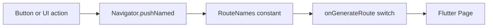

# Routing

## Overview

Routing controls how users move between screens. Afia uses Flutter's named routes with a manual `onGenerateRoute` switch in `AppRouter`, and route constants are stored in `RouteNames`.

## Problem Statement

Afia has authentication screens, onboarding, a main shell, tab destinations, profile pages, progress pages, and feature-specific screens such as meal search and explore. Hardcoded route strings spread across widgets would create fragile navigation and make rename errors difficult to catch.

## Why We Chose It

Manual routing is appropriate for this project because navigation is structured but not yet complex enough to require deep linking, guarded nested routing, or browser URL synchronization. The team can see all navigation targets in one file, which is useful for review and debugging.

## How It Is Used In Our Project

The main shell uses tab selection for core app sections, while standalone flows like login, signup, profile, and meal search use named routes.

## Advantages

- **Centralized route mapping**: All page construction is visible.
- **String consistency**: Constants reduce typo risk.
- **Low dependency overhead**: No extra router package required.
- **Simple arguments**: Some routes can receive `settings.arguments` when needed.

## Tradeoffs

- **No compile-time route safety**: Route names are still strings.
- **Manual maintenance**: Every route must be added to both constants and router.
- **Limited deep-link support**: More work is needed for external links.
- **Large switch statement**: The router can grow long as pages increase.

## Alternatives Considered

| Alternative | Strength | Reason Not Primary |
|---|---|---|
| `go_router` | Deep links, redirects, nested routes | More abstraction than needed now |
| AutoRoute | Generated typed routes | Requires code generation setup |
| Direct `MaterialPageRoute` everywhere | Quick for prototypes | Scatters navigation construction |

## Why This Choice Fits Our Project Better

Afia's current priority is a stable mobile demo with clear flows. Manual named routing is easy for all team members to understand and defend. It can later migrate to `go_router` if deep linking, web support, or complex guards become important.

## Scalability Analysis

Manual routing scales acceptably for a medium mobile app. As routes grow, grouping by feature and using helper methods can reduce switch size. For larger production requirements, the team should evaluate typed or declarative routing.

## Interview / Discussion Questions

1. **Why centralize route names?**  
   To reduce duplicated strings and make route changes easier to audit.

2. **What does `onGenerateRoute` provide?**  
   A single place to map route names and arguments to page widgets.

3. **Why not use `go_router` now?**  
   Current navigation does not require its advanced features.

4. **How are tabs different from routes?**  
   Tabs switch content inside the main shell; routes push new pages onto the stack.

5. **What is a limitation of string routes?**  
   Typos may only appear at runtime.

6. **How should arguments be handled?**  
   Validate and type-check them at route creation.

7. **Where should auth guarding live?**  
   In an auth gate or route guard pattern, not scattered across buttons.

8. **How would deep links change this design?**  
   A declarative router would likely become more appropriate.

9. **Why avoid hardcoded route strings in widgets?**  
   Constants improve consistency and discoverability.

10. **What is the risk of a large router file?**  
   It can become harder to maintain unless grouped clearly.

## Common Mistakes

- Navigating with literal strings.
- Passing untyped argument maps without validation.
- Treating tab selection and route navigation as the same concern.
- Adding routes without updating `RouteNames`.

## Best Practices

- Use `RouteNames` constants.
- Keep route construction simple.
- Validate route arguments.
- Move to a declarative router when deep linking or route guards become central.

## Summary

Manual named routing fits Afia's current size and mobile-first flow. It is understandable, low overhead, and easy to review, while leaving room for a more advanced router later.
