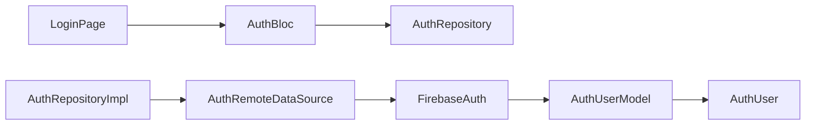

# Firebase Authentication

## Overview

Firebase Authentication provides managed user identity for email/password and federated login providers. In Afia, it is used through an `AuthRemoteDataSource`, then exposed to the app through repository and Bloc layers.

## Problem Statement

Authentication requires secure password handling, identity provider integration, session persistence, password reset, and auth state changes. Implementing this from scratch would distract from the project's nutrition and AI goals and would increase security risk.

## Why We Chose It

Firebase Auth is appropriate because Afia needs a reliable identity layer quickly, including email/password, Google, and Apple sign-in. The project can focus custom backend work on profile, meal, and health data while delegating credential handling to a managed provider.

## How It Is Used In Our Project

`AuthRemoteDataSourceImpl` wraps Firebase SDK calls and social sign-in providers. `AuthUserModel` maps Firebase users to the app's auth user entity.

## Advantages

- **Managed credential security**: Password storage and token handling are not custom-built.
- **Session handling**: Firebase provides current user and auth state streams.
- **Social login support**: Google and Apple sign-in are available.
- **Mobile SDK maturity**: Flutter packages are maintained for common auth flows.

## Tradeoffs

- **Provider coupling in data layer**: Firebase-specific SDK behavior must be understood.
- **Configuration complexity**: Android/iOS Firebase setup must be correct.
- **Vendor dependency**: Moving away from Firebase requires replacing auth datasource logic.
- **Policy decisions remain ours**: Email verification and onboarding requirements still need app logic.

## Alternatives Considered

| Alternative | Strength | Limitation For Afia |
|---|---|---|
| Custom auth backend | Full control | Higher security and maintenance burden |
| Supabase Auth | Strong fit with Supabase data | Project already uses Firebase auth and social setup |
| Auth0 | Enterprise features | More than needed for graduation scope |

## Why This Choice Fits Our Project Better

Afia uses Firebase Auth as a focused identity provider while using Supabase for several application data operations. This split is acceptable because authentication and application data have different requirements. The app isolates Firebase behind `AuthRepository`, reducing direct coupling.

## Scalability Analysis

Firebase Auth can support more providers and auth state listeners as the app grows. The important scaling concern is authorization: Supabase and Firebase identities must stay aligned, often through token exchange or user ID mapping.

## Interview / Discussion Questions

1. **Why not store passwords in Supabase manually?**  
   Secure password auth is difficult and should use a managed identity provider.

2. **Where is Firebase imported?**  
   In the data layer, not domain or presentation business logic.

3. **What is `authStateChanges` used for?**  
   It lets the app react to login/logout state.

4. **Why map Firebase user to `AuthUser`?**  
   To avoid leaking Firebase classes across the app.

5. **What is the risk of disabling email verification?**  
   Unverified accounts may access features unless another validation policy exists.

6. **How do Google and Apple sign-in work conceptually?**  
   The provider returns credentials that Firebase exchanges for an authenticated user.

7. **What is vendor lock-in here?**  
   Auth behavior depends on Firebase APIs, though it is isolated in a datasource.

8. **How would you migrate auth providers?**  
   Implement a new datasource and repository mapping while preserving domain contracts.

9. **Where should auth errors be converted?**  
   Repository or Bloc layers should convert them into user-safe states.

10. **Why not call Firebase from widgets?**  
   It would couple UI to infrastructure and complicate tests.

## Common Mistakes

- Exposing Firebase `User` objects throughout the app.
- Handling auth errors only by printing them.
- Forgetting platform configuration files.
- Confusing authentication with profile data storage.

## Best Practices

- Keep Firebase calls in auth datasource.
- Normalize provider errors into app states.
- Avoid logging tokens or credentials.
- Keep user profile fields outside the auth provider unless they belong to identity.

## Summary

Firebase Authentication fits Afia because it solves identity securely and quickly while allowing the team to focus on nutrition, profile, and AI functionality. Its tradeoff is provider dependency, reduced by keeping it behind repository boundaries.
