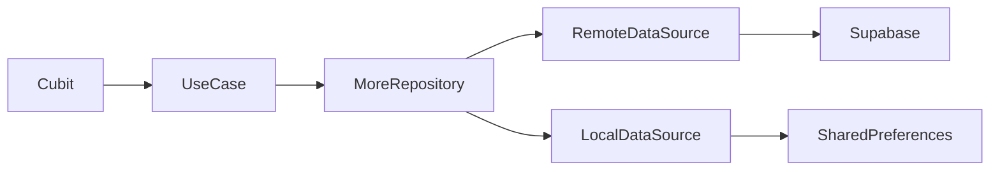

# Supabase Data and Storage

## Overview

Supabase provides hosted Postgres, APIs, and storage. In Afia, it is used for application data such as profile-related records, diet preferences, and image upload workflows in the More feature.

## Problem Statement

Afia needs structured user-owned data beyond identity: profiles, diet preferences, progress-related values, meal and water records, and media. Authentication alone does not solve relational data storage or file storage.

## Why We Chose It

Supabase is appropriate because the app's data is naturally relational: user profile, preferences, daily metrics, meals, and history can be modeled as tables. It also provides storage for profile images and potentially food images, while remaining straightforward for a student team to inspect through SQL.

## How It Is Used In Our Project

The More feature uses remote and local datasources. Remote operations synchronize with Supabase, while local operations cache profile and preferences.

## Advantages

- **Relational model**: Fits structured nutrition and profile data.
- **SQL visibility**: Tables and queries are easier to discuss academically.
- **Storage support**: Can hold profile and meal images.
- **Client SDK**: Flutter integration reduces custom API code.
- **Works with cache strategy**: Repository can combine Supabase and local data.

## Tradeoffs

- **Dual-backend complexity**: Firebase Auth plus Supabase data requires identity coordination.
- **Security policy work**: Row-level security must be designed carefully.
- **Schema migration responsibility**: The team must manage database evolution.
- **Network dependency**: Offline behavior needs explicit caching.

## Alternatives Considered

| Alternative | Strength | Limitation |
|---|---|---|
| Firestore | Works well with Firebase Auth | Less relational and query shape differs |
| Custom REST backend | Maximum control | More backend work for this project |
| Local-only storage | Simple | Cannot support sync or multi-device data |

## Why This Choice Fits Our Project Better

Afia benefits from SQL-style modeling for health metrics, preferences, and logs. Supabase also gives the team a visible database design that can be explained in the final discussion. Firebase Auth remains focused on identity rather than becoming the only backend choice.

## Scalability Analysis

Supabase can scale feature data by adding tables and policies. The main risks are schema discipline, index design, and identity mapping. As data volume grows, queries should be measured and pagination should be introduced for history-heavy screens.

## Interview / Discussion Questions

1. **Why use Supabase if Firebase is already used?**  
   Firebase handles identity; Supabase handles relational app data.

2. **What is row-level security?**  
   Database policies that restrict which rows each user can access.

3. **Where should Supabase calls live?**  
   In remote datasources.

4. **Why cache Supabase data locally?**  
   To improve perceived performance and tolerate network failures.

5. **What is the main risk of two backend providers?**  
   Keeping user identity consistent between them.

6. **Why is SQL useful for this project?**  
   Health and nutrition records are structured and often queried by user/date.

7. **How should profile image upload be handled?**  
   Upload bytes to storage, then persist the resulting URL in profile data.

8. **What should not be stored in Supabase tables?**  
   Raw passwords or provider auth secrets.

9. **How would you optimize history queries?**  
   Use indexes, date filters, and pagination.

10. **How do repositories help Supabase integration?**  
   They hide SDK details and coordinate cache fallback.

## Common Mistakes

- Treating Supabase security rules as optional.
- Exposing table response maps directly to widgets.
- Loading unbounded history lists.
- Assuming Firebase UID and Supabase user identity automatically match.

## Best Practices

- Keep SQL schema documented.
- Use row-level security for user-owned data.
- Add indexes for user/date queries.
- Keep upload paths predictable and user-scoped.
- Cache read-heavy profile data locally.

## Summary

Supabase fits Afia's structured application data and media needs. It introduces identity coordination and schema responsibilities, but those tradeoffs are manageable with repository boundaries and clear policies.
