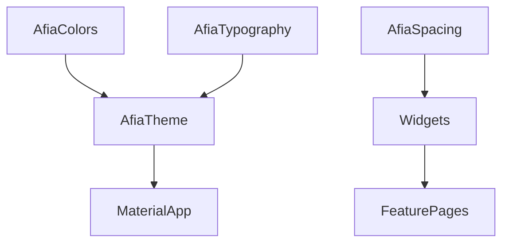

# Theme System

## Overview

The theme system centralizes colors, typography, spacing, and component styling. Afia defines design tokens in `core/theme` and shared widgets in `core/widgets`.

## Problem Statement

Afia has many screens: onboarding, authentication, dashboard, meals, water, AI, profile, settings, and progress. If each screen hardcodes colors, font sizes, and spacing, the UI becomes inconsistent and expensive to change.

## Why We Chose It

A token-based theme is appropriate because the app needs a consistent Arabic-first mobile experience across independent features. The team can build screens in parallel while still using the same visual language.

## How It Is Used In Our Project

Important files include:

- `lib/core/theme/afia_colors.dart`
- `lib/core/theme/afia_typography.dart`
- `lib/core/theme/afia_spacing.dart`
- `lib/core/theme/afia_theme.dart`
- shared widgets such as `AfiaBarChartCard`, `AfiaEmptyState`, and `AfiaErrorState`

## Advantages

- **Visual consistency**: Features use the same tokens.
- **Maintainability**: Brand color or typography changes happen centrally.
- **Faster implementation**: Shared widgets reduce repeated UI work.
- **Reviewability**: Instructors can inspect design decisions in one place.
- **Localization readiness**: Directional spacing and typography can be standardized.

## Tradeoffs

- **Initial setup cost**: Tokens and widgets take time to define.
- **Token discipline**: Developers must avoid hardcoded values.
- **Design constraints**: Some screens may need exceptions, which should be deliberate.
- **Migration effort**: Existing hardcoded UI must be cleaned up over time.

## Alternatives Considered

| Alternative | Strength | Limitation |
|---|---|---|
| Hardcoded styling | Fast for one screen | Inconsistent across many screens |
| Third-party design system | Many components | May not match app identity or Arabic needs |
| Material defaults only | Low effort | Less control over brand and density |

## Why This Choice Fits Our Project Better

Afia has multiple contributors and a health/wellness domain where clarity matters. A restrained, shared theme keeps the app coherent without forcing a heavy external component framework.

## Scalability Analysis

As features grow, shared widgets can cover repeated patterns such as metric cards, progress charts, empty states, and error states. For Arabic support, spacing should prefer `EdgeInsetsDirectional`, and text styles should be tested in RTL layouts.

## Interview / Discussion Questions

1. **Why use design tokens?**  
   They centralize visual decisions and reduce duplication.

2. **What should not be hardcoded in widgets?**  
   Common colors, spacing, typography, and radii.

3. **How does theme help team collaboration?**  
   Developers build independently while preserving consistency.

4. **Why use shared widgets?**  
   To reuse tested UI patterns across features.

5. **What is the risk of too many shared widgets?**  
   Over-generalization can make simple UI hard to change.

6. **How does RTL affect design?**  
   Layout direction, padding, icons, and alignment must adapt.

7. **Why not use only Material defaults?**  
   The app needs its own brand and information hierarchy.

8. **How should dark mode be added?**  
   Extend theme tokens and test contrast, not invert colors manually.

9. **What makes a metric card reusable?**  
   Stable layout, token usage, and configurable content.

10. **How can UI consistency be reviewed?**  
   Check token usage and shared widget adoption during code review.

## Common Mistakes

- Hardcoding colors that already exist in `AfiaColors`.
- Using absolute left/right padding instead of directional padding.
- Creating a shared widget before the pattern is actually repeated.
- Ignoring text overflow in Arabic.

## Best Practices

- Use `AfiaColors`, `AfiaTypography`, and `AfiaSpacing`.
- Prefer directional layout APIs for RTL readiness.
- Keep shared widgets focused.
- Test screens with long Arabic text.
- Add dark theme through tokens, not ad hoc overrides.

## Summary

The theme system fits Afia because it gives a multi-feature app a consistent and maintainable UI foundation. It requires discipline, but that discipline reduces visual drift across the project.
