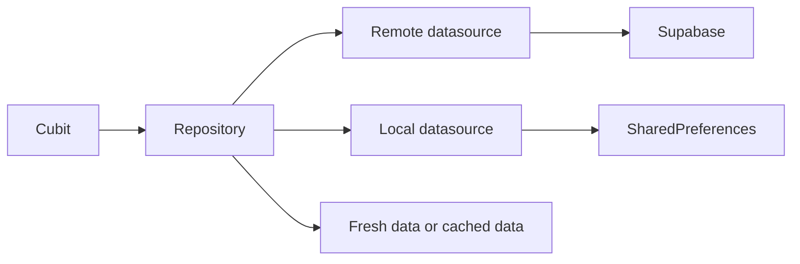

# Caching and Offline Support

## Overview

Caching stores selected data locally so the app can load faster and tolerate temporary network failure. In Afia, local persistence is currently used through `SharedPreferences` for profile and preference data, and some AI chat history behavior has also used local storage.

## Problem Statement

Nutrition apps are used repeatedly throughout the day. Users expect profile settings, diet preferences, water logs, and recent history to remain visible even when the network is slow. Without caching, every screen depends entirely on external services and becomes fragile during demos or poor connectivity.

## Why We Chose It

Caching is appropriate for Afia because many reads are user-specific and frequently repeated. Profile and preference values do not need to be fetched from Supabase every time a screen opens. A repository can fetch remote data when possible and fall back to local data on failure.

## How It Is Used In Our Project

`MoreRepositoryImpl` demonstrates this pattern: it tries remote reads, caches successful responses, and falls back to cached values when remote access fails.

## Advantages

- **Better perceived performance**: Frequently used data appears quickly.
- **Network resilience**: Some screens remain useful during connection problems.
- **Cleaner recovery logic**: Repositories decide when cached data is acceptable.
- **Reduced backend load**: Stable data does not need constant refetching.

## Tradeoffs

- **Stale data**: Cached values may not reflect server state.
- **Invalidation complexity**: The app must decide when cache should be refreshed.
- **Storage limits**: `SharedPreferences` is not suitable for large histories or images.
- **Sync conflicts**: Offline writes require stronger conflict handling than read fallback.

## Alternatives Considered

| Alternative | Strength | Limitation |
|---|---|---|
| No cache | Simpler | Poor network behavior |
| SQLite/Drift | Good for relational offline data | More setup than needed for simple preferences |
| Hive | Fast local objects | Additional dependency and schema discipline |
| Secure storage | Protects sensitive values | Not intended for large general cache |

## Why This Choice Fits Our Project Better

At the current stage, `SharedPreferences` is sufficient for small profile and preference records. Larger offline support for meal history or daily metrics should move to a more structured local database if the app grows.

## Scalability Analysis

Caching scales when data is categorized by volatility. Profile preferences can be cached aggressively; meal and water logs need date-based refresh and conflict strategy; AI responses should usually be reviewed before storage. As offline support grows, the team should introduce explicit cache timestamps and possibly a local database.

## Interview / Discussion Questions

1. **What data is safe to cache?**  
   Non-sensitive, small, frequently read data such as preferences and profile display fields.

2. **What is stale data?**  
   Local data that no longer matches the server.

3. **Where should cache fallback happen?**  
   In repositories, because they coordinate data sources.

4. **Why is `SharedPreferences` not enough for all offline support?**  
   It is key-value storage, not a relational or queryable database.

5. **How do you handle failed remote reads?**  
   Try cached data if it is acceptable, otherwise return a cache or server failure.

6. **How do you handle failed remote writes?**  
   Either fail clearly or queue writes with conflict handling; Afia should be explicit.

7. **Should auth tokens be stored in SharedPreferences?**  
   No. Sensitive values require secure storage or SDK-managed storage.

8. **What is cache invalidation?**  
   Deciding when cached data is no longer valid.

9. **How can cache behavior be tested?**  
   Mock remote failures and assert local fallback.

10. **What is the next step for richer offline support?**  
   Introduce a structured local database and sync policy.

## Common Mistakes

- Caching sensitive data without protection.
- Treating cached data as always fresh.
- Mixing cache reads directly into widgets.
- Using key-value storage for large historical datasets.

## Best Practices

- Cache only data with a clear freshness policy.
- Add timestamps for non-trivial cached records.
- Keep fallback logic in repositories.
- Use secure storage for secrets.
- Use a local database for query-heavy offline history.

## Summary

Caching fits Afia because it improves reliability and perceived performance for repeated user data. The current approach is appropriate for small records, but richer offline support will need stronger local storage and sync rules.
