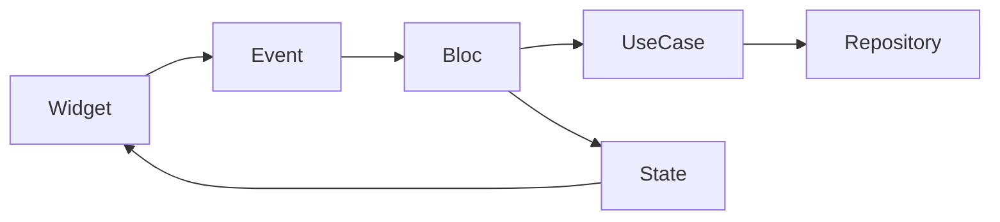

# BLoC

## Overview

BLoC separates user events from UI rendering. A page sends events to a Bloc, the Bloc performs work through use cases or repositories, and then emits states that the widget tree renders.

## Problem Statement

Afia has flows that are event-driven and asynchronous: login, signup, food search, AI image analysis, and explore actions. If those flows are implemented directly inside widgets, UI code becomes difficult to test and rebuild behavior becomes unpredictable.

## Why We Chose It

BLoC fits Afia's complex flows because events make user intent explicit. Auth is a good example: sign in, sign up, reset password, and sign out are separate events that can produce loading, authenticated, unauthenticated, and error states. That model is easier to test than widget callbacks with local booleans.

## How It Is Used In Our Project

The project uses `flutter_bloc`, `equatable`, and in some places can use `bloc_concurrency` for event control.

## Advantages

- **Predictable state transitions**: Events and states are explicit.
- **Testability**: Bloc tests can verify emitted states.
- **Async control**: Loading, success, failure, and cancellation are easier to model.
- **Separation from widgets**: Widgets become renderers of state.

## Tradeoffs

- **Boilerplate**: Events, states, and bloc classes add files.
- **Learning curve**: Developers must understand streams and immutable states.
- **Overuse risk**: Simple toggles may not need a Bloc.
- **Verbose debugging**: Many small classes can make tracing slower.

## Alternatives Considered

| Alternative | Strength | Limitation For Afia |
|---|---|---|
| Provider + ChangeNotifier | Simpler | Less explicit event modeling |
| Riverpod | Strong dependency/state model | Would introduce a different architecture style |
| setState | Fast for local UI | Not suitable for auth/data flows |

## Why This Choice Fits Our Project Better

Afia already uses Clean Architecture and repository boundaries. BLoC sits naturally above use cases and gives instructors a clear way to inspect how user actions become domain operations.

## Scalability Analysis

BLoC scales well for features with many events and states. New developers can inspect event and state files to understand the flow. Testing scales because each event can be tested independently with mocked dependencies.

## Interview / Discussion Questions

1. **Why use Bloc for Auth?**  
   Auth has multiple asynchronous commands and state outcomes.

2. **What is the role of an event?**  
   It represents user or system intent.

3. **What is the role of a state?**  
   It represents the UI-relevant result of processing.

4. **Why use Equatable?**  
   It enables reliable value comparison and avoids unnecessary rebuild confusion.

5. **Where should repository calls happen?**  
   Inside Bloc or use cases, not in widgets.

6. **When is Bloc too much?**  
   For simple local toggles with no async workflow.

7. **How does Bloc help testing?**  
   Tests dispatch events and assert emitted states.

8. **What is event concurrency?**  
   Control over overlapping events, useful for search or repeated taps.

9. **Why should states be immutable?**  
   It makes transitions predictable and comparable.

10. **What is a common Bloc anti-pattern?**  
   Storing provider SDK objects or BuildContext inside the Bloc.

## Common Mistakes

- Creating one huge Bloc for unrelated features.
- Mutating state objects.
- Emitting raw exceptions instead of user-safe failure states.
- Dispatching events from build methods repeatedly.

## Best Practices

- Keep events named after intent.
- Keep states immutable and comparable.
- Use Bloc for complex flows and Cubit for simpler state.
- Test error and loading paths.

## Summary

BLoC is appropriate for Afia's event-heavy workflows because it creates explicit, testable state transitions. Its boilerplate is justified for complex flows but should not be forced onto every small UI interaction.
