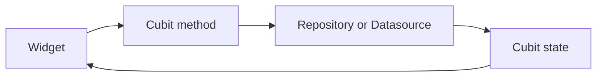

# Cubit

## Overview

Cubit is a simpler state management primitive from the BLoC library. Instead of receiving event classes, it exposes methods that directly emit new states.

## Problem Statement

Not every Afia feature needs a full event-driven Bloc. Tab selection, water amount updates, local dashboard state, and form-like screens often have straightforward state transitions. Full Bloc structure would add files without improving clarity.

## Why We Chose It

Cubit fits Afia's simpler flows because it keeps state predictable while reducing ceremony. `MainShellCubit`, `WaterRecordingCubit`, `MealsCubit`, and profile-related cubits are examples where method calls are easier to read than event dispatch.

## How It Is Used In Our Project

Some cubits still use mock or direct datasource access while features are being completed. Longer-term, data-heavy cubits should depend on use cases or repositories.

## Advantages

- **Less boilerplate**: No separate event classes.
- **Readable intent**: Methods such as `loadProfile()` or `selectTab()` are direct.
- **Good fit for linear state**: Works well for toggles, forms, and local feature state.
- **Same ecosystem as Bloc**: Uses `BlocBuilder`, `BlocProvider`, and `Equatable`.

## Tradeoffs

- **Less event history**: Intent is represented by methods, not event objects.
- **Can grow too large**: Complex flows may need Bloc instead.
- **Async overlap risk**: Repeated method calls need manual handling.
- **Testing still required**: Simpler does not mean risk-free.

## Alternatives Considered

| Alternative | Strength | Limitation |
|---|---|---|
| Full Bloc | More explicit events | Too much ceremony for simple state |
| setState | Minimal | State not reusable or testable |
| ValueNotifier | Lightweight | Less structured for feature state |

## Why This Choice Fits Our Project Better

Afia needs both complex and simple state tools. Using Cubit where appropriate keeps the codebase practical and avoids turning every small screen interaction into a formal event model.

## Scalability Analysis

Cubit scales well while a feature remains linear. If a cubit accumulates many methods, competing async operations, or complicated state transitions, it should be refactored into a Bloc or split into smaller cubits.

## Interview / Discussion Questions

1. **How is Cubit different from Bloc?**  
   Cubit uses methods directly; Bloc processes event objects.

2. **Why use Cubit for tabs?**  
   Tab selection is a simple state transition.

3. **Can Cubit call repositories?**  
   Yes, especially for simple flows, though use cases may be better for domain rules.

4. **When should Cubit become Bloc?**  
   When event modeling, concurrency, or complex workflows become important.

5. **Does Cubit replace Clean Architecture?**  
   No. It is only a presentation-layer state tool.

6. **Why use immutable state with Cubit?**  
   To keep rebuilds predictable and tests reliable.

7. **What is a Cubit anti-pattern?**  
   Mixing many unrelated screen responsibilities into one cubit.

8. **Can Cubit handle async operations?**  
   Yes, but overlapping calls must be handled carefully.

9. **How is Cubit tested?**  
   Call methods and assert emitted states.

10. **Why not use setState everywhere?**  
   Feature state needs to survive widget rebuilds and be testable.

## Common Mistakes

- Using Cubit as a global mutable store.
- Letting Cubit states contain controllers or contexts.
- Avoiding repositories and putting backend logic in Cubit.
- Not modeling loading and error states.

## Best Practices

- Use Cubit for simple, direct workflows.
- Keep state classes immutable.
- Emit loading, success, and error states for async work.
- Refactor when Cubit methods become complex.

## Summary

Cubit is appropriate for Afia's simpler feature states. It gives the team structured state management without the full event boilerplate of Bloc.
