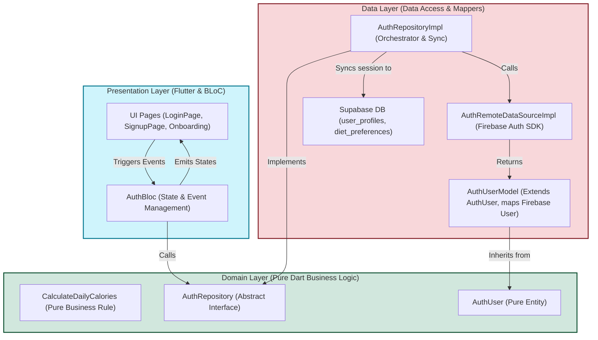
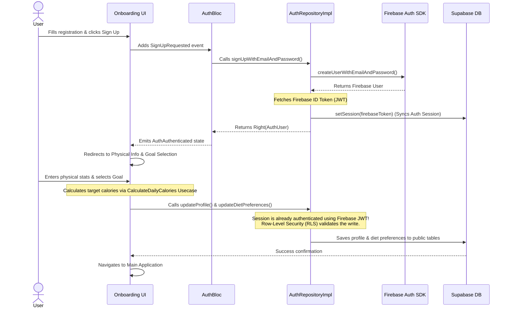

# Authentication Feature Architecture — Afia App

This document details the Feature-First Clean Architecture structure implemented for the **Authentication** module of the Afia nutrition and wellness application.

---

## 🏗️ Architectural Overview

The authentication feature is structured using the three layers of Clean Architecture: **Presentation**, **Domain**, and **Data**. 

A unique aspect of Afia's auth architecture is that it coordinates two backend services:
1. **Firebase Authentication**: Used as the primary Identity Provider (handles credentials, social sign-ins, and session tokens).
2. **Supabase Database**: Used as the relational storage engine. When authentication succeeds, the user's session token is synchronized with Supabase, allowing secure writes to database tables (like `user_profiles` and `diet_preferences`) under Row-Level Security (RLS).

---

## 📊 Dependency & Structure Diagram

The diagram below shows the structural components and the direction of dependencies (pointing inwards toward the pure Domain layer):



---

## 📁 File Structure

```
lib/features/auth/
├── data/
│   ├── datasources/
│   │   └── auth_remote_datasource.dart    # Directly interacts with Firebase, Google, and Apple SDKs.
│   ├── models/
│   │   └── auth_user_model.dart           # Maps Firebase user data structures into a clean entity.
│   └── repositories/
│       └── auth_repository_impl.dart      # Implements the domain contract, maps exceptions, and syncs Supabase session.
├── domain/
│   ├── entities/
│   │   └── auth_user.dart                 # Pure business representation of a user (ID, email, name).
│   ├── repositories/
│   │   └── auth_repository.dart           # Abstract repository interface defining the auth contract.
│   └── usecases/
│       └── calculate_daily_calories.dart  # Usecase implementing BMR / Mifflin-St Jeor calculation logic.
└── presentation/
    ├── bloc/
    │   ├── auth_bloc.dart                 # Receives UI events, runs logic, and emits states.
    │   ├── auth_event.dart                # Discrete UI input events (Login, SignOut, SignUp).
    │   └── auth_state.dart                # Representation of current authentication UI state.
    └── pages/
        ├── auth_page.dart                 # Session Guard determining the initial app landing page.
        ├── login_page.dart                # Email/Password + Google/Apple Sign-In page.
        ├── signup_page.dart               # Registration credentials form.
        ├── forgot_password_page.dart      # Password reset request form.
        ├── physical_information_page.dart # Step 1 of onboarding (gender, weight, height).
        └── goal_selection_page.dart       # Step 2 of onboarding (goals selection & Supabase profile save).
```

---

## 🔄 Runtime Flow (Sign-up & Onboarding)

When a user signs up and completes their physical profile information, the following sequence of events takes place to synchronize Firebase and Supabase:



---

## 🔑 Key Architectural Decisions

1. **Custom JWT Provider Integration**: 
   By grabbing the Firebase ID Token (`getIdToken()`) and passing it to Supabase (`setSession()`), we bridge the authentication state. Supabase validates the token signature using Google's public keys, establishing a secure database session where Postgres RLS checks (`auth.uid() = id`) succeed.
2. **Ambiguous Import Resolution**: 
   Since both the local domain layer and the `supabase_flutter` library export a class named `AuthUser`, conflicts are prevented by hiding Supabase's definition:
   ```dart
   import 'package:supabase_flutter/supabase_flutter.dart' hide AuthUser;
   ```
3. **Pure Business Usecase**:
   The BMR and calorie targets calculation (`CalculateDailyCalories`) is implemented directly in the Domain layer as it is a pure business rule containing mathematical formulas (Mifflin-St Jeor) with no hardware or library dependencies.
